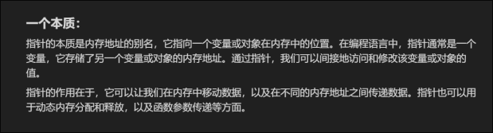
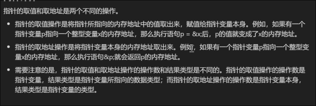
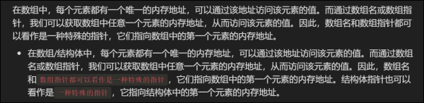
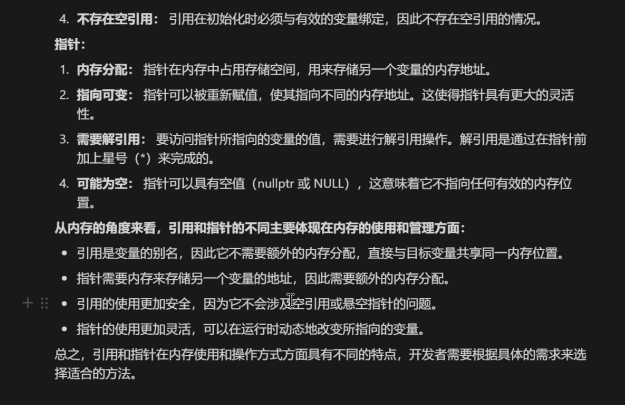
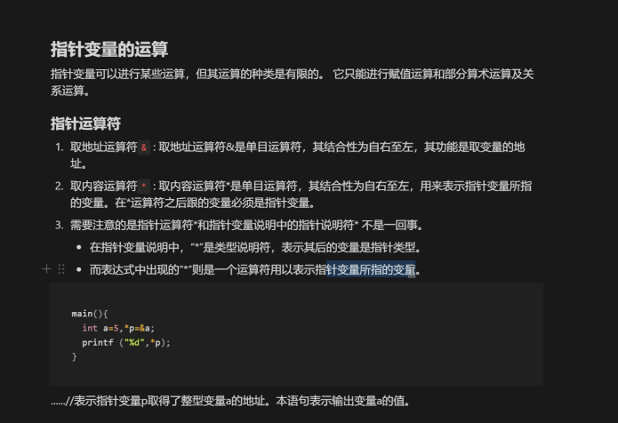
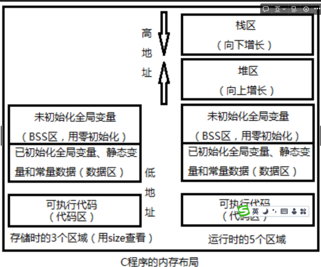
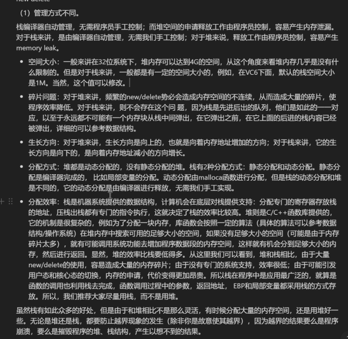
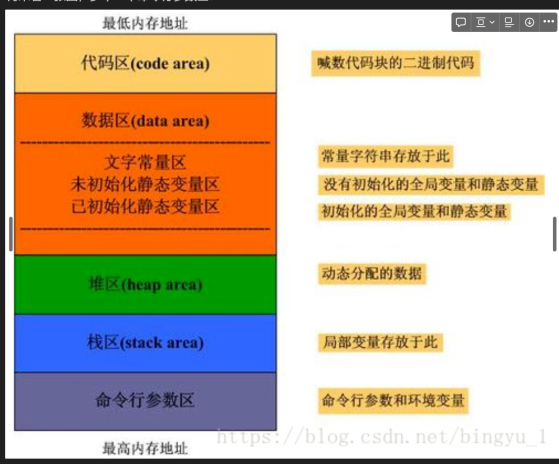
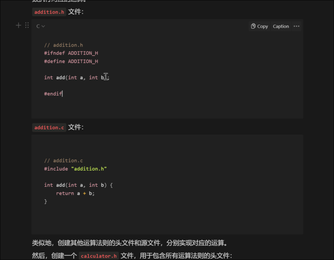

[TOC]

### 简单代码

#### hello.c

```c
#include <stdio.h>
int main() 
{
	printf("Hello World!");   
	return 0;
}
```

### 什么是面向过程什么是面向对象

### linux中的编译链接

查看gcc&g++版本

```shell
gcc -v
```

```shell
g++ -v
```

### 编译链接过程

#### 1、预处理

> 删除所有define 展开所有的宏定义
>
> 处理所有预编译指令#if等
>
> 处理所有#include预编译指令，将头文件插入
>
> 删除注释
>
> 添加行号与文件标识

```shell
gcc -E hello.c -o a.c
```

####  2、编译

> 词法分析 变量与变量定义
>
> 语法分析 符号确实
>
> 语义
>
> 代码优化

```shell
gcc -S a.c -o a.s
```

####  3、汇编

> 将汇编翻译为二进制格式

```
gcc -c a.s -o a.o
```

#### 4、 链接

```shell
gcc hello.o -o hello
```

一般一步执行,即可完成所有步骤

```shell
gcc main.c -o main 
```


### 输入与输出

声明，先声明，后定义，才使用

```c
#include<stdio.h>
int main()
{
    int a=0,b=0;
    printf("in a\n");
    scanf("%d",&a);
    printf("in a\n");
    scanf("%d",&b);
    printf("sum:%d\n",a+b);
    return 0;
}
```

```c++
#include <iostream>
// using namespace std;
int main(){
    int a=0,b=0,sub=0;
    std::cout<<"in a"<<std::endl;
    std::cin>>a;
    std::cout<<"in b"<<std::endl;
    std::cin>>b;
    std::cout<<"sum"<<a+b<<std::endl;
    return 0;
}
```

### 变量

32位代表地址的长度为内存空间2^32，内存最大4G

声明，分配了一个空间，未赋值值未知

int dim=2.0

> 所有变量需要声明，先声明，后定义(赋值)，才使用
>
> 声明，只是在内存开辟空间，但是值未知
>
> 当声明完毕后，定义就是向开辟的空间赋初值
>
> 任何一个变量都有地址，函数也有

1、声明变量名dim

2、值类型为int 

3、值为2

> 在0xAB的地址值为00000010，地址 值，内存只认**地址与值**  还有长度

32位64位 ，有区别

cha a1； 1字节

int a2； 4字节 

数组型，长度x类型

生命周期


#### [puts 和printf的区别](https://blog.csdn.net/weixin_46196863/article/details/114630563)

1、puts不可进行格式的转换，仅可以输出字符串，或者字符串的数组名；而printf有多种输出格式可以添加各种转义字符

2、puts()函数的作用与语句printf("%s\n",s);的作用形同。

3、puts()在输出字符串后，会自动换行，而printf不会自动换行。

3、返回值不同 puts函数返回一个非负值表示成功、printf函数返回所写的字符总数，如果出现写入错误，则返回负数。


#### sprintf

将格式化字符串传到str

```c
#include <stdio.h>
#include <math.h>

int main()
{
  char str[80];
  sprintf(str, "Pi 的值 = %f", M_PI);
  puts(str);
  return(0);
}
```


### 函数

```c
#include <stdio.h>

int add(int a,int b);

int main() 
{
    int a=0,b=0,sub=0;
    printf("in a\n");
    scanf("%d",&a);
    printf("in b\n");
    scanf("%d",&b);
    sub=add(a,b);//实参
    printf("sub:%d\n",sub);
	return 0;
}

int add(int a,int b){//形参int a,int b入参
    return a+b;
}
```

尽管都放内存，add放在代码区，而输入参数作为变量放在数据区

仅可读，变量可读可写

函数的入参可以为空

返回值也放置在变量区


> 内存为数据区和代码区
>
> 数据区可读写，代码区只读


> 入参，函数的输入参数
>
> 出参，返回值
>
> 形参，函数的参数是形式上的
>
> 实参，调用函数是输入的参数是真实的


值传递，当函数由实参传形参作为值传递，而不是地址的传递

**swap ，交换函数**


### gdb命令

调试使用

生成调试文件

```shell
gcc calculator_int.c -o test1 -g
```

进行gdb调试

```shell
gdb test1 -q
```

断点

```
break <num>
```

运行

```
run
```

继续运行

```
continue
```

查看变量 变量x

```
print x
```


### 指针

解决值传递无法解决的问题

#### 是？

**swap ，交换函数**

c的三大核心，指针为其一

```c
void swap(int *a,int *b){
    int t=0;
    t=*a;
    *a=*b;
    *b=t;
}
```

int *a；其中存储的是地址，而不是变量值

作用，将地址公开化

#### 空指针

```c
int *p;
```

没有指定

如果指到内存code区会出现段错误，是不好的；

自动变为

```c
int *p=NULL;
```

或者

```c
int *p=&a1;
```

将*p的值位a1的地址

#### 坏指针


#### 指针的重要属性

指针的值

​	

指针的类型

​	确定了大小

**+-x/**

#### 本质

指针的本质是地址的别名



### 两种计算

*p 

声明是指针，运算是数值



### 三个便利



1、操作数组结构体便利

数组或者结构体其地址即首元素地址

2、指针函数与函数指针


3、内存的动态分配

malloc

memset 清空

strcpy 拷贝数据

### 引用



### 嵌入式c语言三大核心

```c
int a=0；
```

声明，加定义

开辟空间，赋值0

```c
int *p=&a1;
```

p存储a1的地址，*p是a1地址对应的值

```c
int p[3]
```

数组，长度三

```c
int *p[3]
```

三位长度的数组，但是内部存储的是地址

```c
int {*p}[3]
```

​	与int p[3]等效

数组的地址是数组首元素的地址

```c
int **p
```

指针，指针指向指针

```c
int p(int a)
```

函数

```c
int (*p)(int a);
```

 

函数指针指针函数？



声明时 *p是指针，使用时 *p是数值

声明时：

```c
int *a;
```

使用时：

```c
void sub(int *a,int *b,int *result){
    *result=*a-*b;
}
```

使用 `*a-*b;`进行运算

### 值传递与地址传递各有什么优势？

值传递更耗时（深拷贝），而地址传递不需要真正的拷贝，故地址传递效率高

使用c语言，返回

深拷贝：

```c
int add(int a,int b){
    return a+b;
}
```

地址转换：

```c
void sub(int *a,int *b,int *result){
    *result=*a-*b;
}
```

```c
void mul(int *a){
    a[2]=a[0]*a[1];
}
```

### 结构体

一个复杂的变量

```c
struct  calculator{
    int a[2];
    char cmd;
};
```

内存分配方式为所有变量的空间加和，但是有以下规则

#### 字节对齐

提高效率，牺牲空间

字节占用必定 

32位： 4 8 12

64位： 8 16 24

对于一个32位操作系统，以上结构体占16字节

#### 使用例

```c
#include <stdio.h>

struct  calculator{
    int a[2];
    char cmd;
};

int count_calculator(struct calculator m){
    int result=0;
    switch (m.cmd)
    {
        case '+':
            result=m.a[0]+m.a[1];
            break;
        case '-':
            result=m.a[0]-m.a[1];
            break;
        case '*':
            result=(m.a[0])*(m.a[1]);
            break;
        case '/':
            if (m.a[1]!=0)
            {
                result=(m.a[0])/(m.a[1]);
            }else{
                printf("分母为零，不合法\n");
                result=-1;
            }
            break;
        default:
            printf("未知运算符号\n");
            break;
    }
    return result;
}

int main()
{
    struct calculator m1;
    int quitflag=0;
    // scanf("%c",&m1.cmd);
    // scanf("%d",&m1.a[0]);
    // scanf("%d",&m1.a[1]);
    while (~quitflag)
    {
        printf("*****************************\n");
        printf("输入操作符 + - * / 或者 q/Q \n");
        printf("*****************************\n");
        // getchar();
        scanf("%c",&m1.cmd);
        if(m1.cmd=='Q' || m1.cmd=='q'){
            printf("退出\n");
            quitflag=1;
            break;
        }
        printf("输入第一个操作数\n");
        getchar();
        scanf("%d",&m1.a[0]);

        printf("输入第二个操作数\n");
        getchar();
        scanf("%d",&m1.a[1]);
        printf("计算结果:%d %c %d =%d\n",m1.a[0],m1.cmd,m1.a[1],count_calculator(m1));
        getchar();
    }
    

    return 0;
} 
```

结构体指针

```c
#include <stdio.h>

struct  calculator{
    int a[3];
    char cmd;
};

void count_calculator(struct calculator *m){
    switch (m->cmd)
    {
        case '+':
            m->a[2]=m->a[0]+m->a[1];
            break;
        case '-':
            m->a[2]=m->a[0]-m->a[1];
            break;
        case '*':
            m->a[2]=(m->a[0])*(m->a[1]);
            break;
        case '/':
            if (m->a[1]!=0)
            {
                m->a[2]=(m->a[0])/(m->a[1]);
            }else{
                printf("分母为零，不合法\n");
                m->a[2]=-1;
            }
            break;
        default:
            printf("未知运算符号\n");
            m->a[2]=-2;
            break;
    }
}

int main()
{
    struct calculator m1;
    struct calculator *p=&m1;
    
    int quitflag=0;
    // scanf("%c",&m1.cmd);
    // scanf("%d",&m1.a[0]);
    // scanf("%d",&m1.a[1]);
    while (~quitflag)
    {
        printf("*****************************\n");
        printf("输入操作符 + - * / 或者 q/Q \n");
        printf("*****************************\n");
        // getchar();
        scanf("%c",&p->cmd);
        if(m1.cmd=='Q' || m1.cmd=='q'){
            printf("退出\n");
            quitflag=1;
            break;
        }
        printf("输入第一个操作数\n");
        getchar();
        scanf("%d",&m1.a[0]);

        printf("输入第二个操作数\n");
        getchar();
        scanf("%d",&p->a[1]);
        
        count_calculator(p);
        printf("计算结果:%d %c %d =%d\n",p->a[0],p->cmd,p->a[1],p->a[2]);
        getchar();
    }
    

    return 0;
} 
```


### 数组

```c
int a[4];
```

0~3

数组的内存时连续的

移动4字节即下一位，前提时数组是连续的

```
int a[4]={1,2,3,4};
```


### 程序与进程

```c
kozakemi@kozakemi-virtual-machine:~/study/linux_c$ file main_swap.
c
main_swap.c: C source, ASCII text
kozakemi@kozakemi-virtual-machine:~/study/linux_c$ size a.o
   text    data     bss     dec     hex filename
    404       0       0     404     194 a.o
kozakemi@kozakemi-virtual-machine:~/study/linux_c$ size a.out 
   text    data     bss     dec     hex filename
   2700     632       8    3340     d0c a.out
```

text 代码段

data 数据段 被初始化的变量，静态变量（全局，局部），常量数据。总结，种植就是有值的变量

bss  全局未初始化的变量

以上在磁盘分配

从磁盘调到内存



栈与队列：

栈：有底的水桶 先入后出 first in last out

队列：水管  先入先出 first in last out

堆？


但是内存的栈和数据结构栈不同，内存栈区真实存在，栈为数据结构


程序：在硬盘中的可执行文件

进程：在内存中运行应用程序

### 栈与堆

#### 栈区

​	 由编译器创建，函数参数值，局部变量值，函数返回值

​	由编译器自动分配与自动释放

```c
int add (int a,int b){
	int sum=0;
	sum=a+b;
	return sum;
}
```

​	以上变量均在栈区，离开函数后均被释放

​	故特点为，自动分配，自动释放

​	但有缺点，最大8m

#### 堆区 :

```c
int a=0;//数据
char *p1;//bbs
main()
{
    
    char s[]="abc";//s在栈区，abc在数据区,编译时abc在data区，运行时将数据写到栈
    char *p1,p2;//栈
    char *p3="123456";
    static int c =0;//静态变量，data区
    p1=(char *)malloc(10);//堆  10字节指向malloc第一个地址
    //malloc 开辟动态空间的命令，1、返回的是一个地址，第一个字节，2、分配的是动态内存3、数字是分配的字节，如果int，开辟10个int p1=(int *)malloc(sizeof(int)*10);
    p2=(char *)malloc(20);//堆  10字节指向malloc第一个地址
    free(p1);
    free(p2);
}

```

​	谁建立谁释放

​	最大申请4G

​	重复使用会产生碎片，所释放后的碎小空间无法重复利用

​	




命令行参数区暂时忽略

### malloc

#include<stdlib.h>

堆

```c
void *malloc(size_t size);
```

需要做强制转换后才可知长，例如为 int

```c
int *p = malloc();
free(p);
```

try语句

### 多文件编程

头文件

头文件声明的函数和变量是允许程序调用的

add.h

``` c
#ifndef ADD_H
#define ADD_H
void add(int *a,int *b,int *result);
#endif
```

add.c

此处没有其他的变量之类，#include "add.h"o可有可无

```c
#include "add.h"

void add(int *a,int *b,int *result){
    *result=*a+*b;
}
```



### 全局变量(extern)和静态全局变量(static)

#### extern

但是会使文件出现警告

用于声明外部变量和函数。告诉编译器某个变量或函数的定义在其他文件中，而不是当前文件中

例如

**file1.c**：

```c
// file1.c
#include <stdio.h>

int globalVar = 10; // 定义全局变量

void foo() {
    printf("Hello from foo!\n");
}
```

**file2.c**：

```c
// file2.c
#include <stdio.h>

extern int globalVar; // 声明全局变量
extern void foo();   // 声明函数

int main() {
    printf("The value of globalVar is: %d\n", globalVar);
    foo();
    return 0;
}
```

#### static

**静态全局**

普通全局变量作用于编译的项目，静态全局变量的作用域仅限于定义它的源文件。

**静态局部**

妙用，会出现持久化的情况

```c
#include <stdio.h>

void increment() {
    static int count = 0;
    count++;
    printf("Count: %d\n", count);
}

int main() {
    increment();  // 输出 Count: 1
    increment();  // 输出 Count: 2
    increment();  // 输出 Count: 3
    return 0;
}
```


### makefile

```shell
kozakemi@kozakemi-virtual-machine:~/study/linux_c/multifile$ tree -L 1
.
├── add.c
├── add.h
├── build
├── calculator.h
├── calculator_intpsf.c
├── div.c
├── div.h
├── makefile
├── mul.c
├── mul.h
├── sub.c
└── sub.h

1 directory, 11 files
```


```makefile
CC = gcc
CFLAGS = -Wall -g

all:main.out
#链接
main.out:calculator_intpsf.o add.o sub.o mul.o div.o
	$(CC) $(CFLAGS) calculator_intpsf.o add.o sub.o mul.o div.o -o main.out
#汇编	
calculator_intpsf.o: calculator_intpsf.c calculator.h
	$(CC) $(CFLAGS) -c calculator_intpsf.c -o calculator_intpsf.o
add.o: add.c add.h
	$(CC) $(CFLAGS) -c add.c -o add.o
sub.o: sub.c sub.h
	$(CC) $(CFLAGS) -c sub.c -o sub.o
mul.o: mul.c mul.h
	$(CC) $(CFLAGS) -c mul.c -o mul.o
div.o: div.c div.h
	$(CC) $(CFLAGS) -c div.c -o div.o
#清除
clean:
	rm *.o *.out
#运行
run:
	make clean
	make
	./main.out
#调试
gdb:
	gdb main.out -q
```

