apache2使用8080端口，使用Nginx将其反代到80端口

### A、apache web服务

#### 1、安装apache2

```shell
sudo apt install apache2
```

#### 2、验证网页

直接访问虚拟机ip

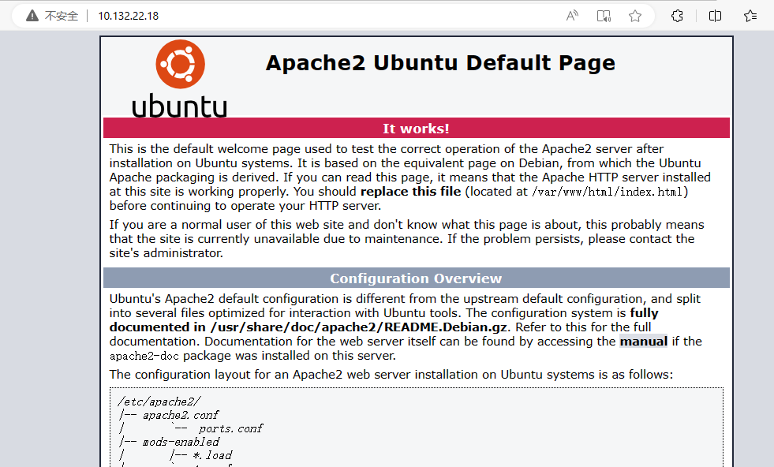

#### 3、书写网页，将其添加到hello.html中

位置再/var/www/html，创建hello.html

```html
<!DOCTYPE html>
<html>
<head>
<meta charset="utf-8">
<title>hello</title>
</head>
<body>
    <h1>陈硕</h1>
    <h2>鲁东大学</h2>
    <h2>20202203220<h2>
</body>
</html>
```

#### 4、验证已经书写的网页

ip/hello.html

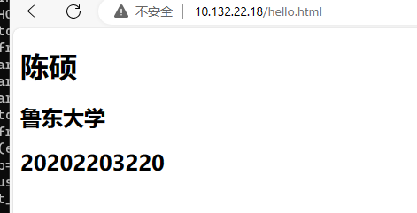

#### 5、修改apache网页的端口为8080

a、配置`/etc/apache2/`下的`ports.conf`文件

```shell
Listen 80 -> Listen 8080
```

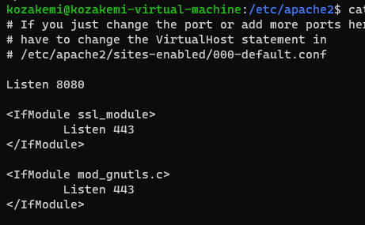

b、配置`/etc/apache2/sites-enabled$`下的 `000-default.conf`文件

```
<VirtualHost *:80> -> <VirtualHost *:8080>
```

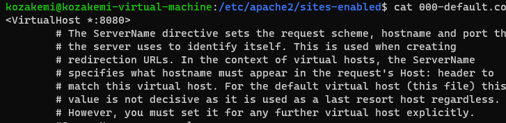

#### 6、修改apache2的www目录，防止与nignx冲突

修改为www_a

a、配置`/etc/apache2/sites-enabled$`下的 `000-default.conf`文件

```
 DocumentRoot /var/www/html ->  DocumentRoot /var/www_a/html
```

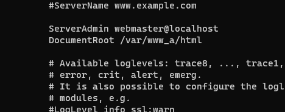

b、配置`/etc/apache2/`下的`apache2.conf`文件

```
<Directory /var/www/>  -> <Directory /var/www_a/>
```

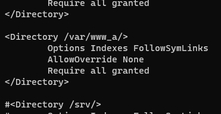

#### 7、浏览器输入ip:8080、ip:8080/hello.html 验证

#### *补充，修改配置后使用`systemctl restart apache2.service`重启apache服务器

### B、Nginx反向代理服务

之前已经将apache2的端口指向8080，现在只需要将端口指向80即可，就是反代

#### 1、安装nginx

```shell
sudo apt install nginx
```

#### 2、配置nginx

需要修改的配置文件位于`/etc/nginx/sites-enabled`的`defaul`文件

只需要修改server部分

```shell
server {
        listen 80 default_server;
        listen [::]:80 default_server;
        root /var/www/html;
        server_name _;
        location / {
                # First attempt to serve request as file, then
                # as directory, then fall back to displaying a 4
                proxy_pass http://127.0.0.1:8080/;
                #try_files $uri $uri/ =404;
        }
}
```

简单的静态页面80反代8080

#### 3、重启nginx

```shell
sudo systemctl restart nginx.service
```

#### 4、输入ip地址而不是ip:8080再次验证网页


### C、配置防火墙firewall

ubuntu自带ufw，但是firewalld需要额外安装

#### 简单介绍firewall

```shell
sudo apt install firewalld
```

检查运行状态

```shell
sudo systemctl status firewalld.service
```

检查运行区域

```shell
sudo firewall-cmd --get-default-zone
```

查看默认区域的规则

```shell
sudo firewall-cmd --zone=public --list-all
```

放行80端口

```shell
sudo firewall-cmd --zone=public --add-port=80/tcp --permanent
```

删除放行80端口

```shell
sudo firewall-cmd --zone=public --remove-port=80/tcp --permanent
```

ban ip

```shell
sudo firewall-cmd --permanent --add-rich-rule="rule family="ipv4" source address="10.132.22.231" port protocol="tcp" port="80" reject"
```

```shell
sudo firewall-cmd --permanent --add-rich-rule="rule family="ipv4" source address="10.132.22.106" drop"
```

unban ip

```shell
sudo firewall-cmd --permanent --remove-rich-rule='rule family="ipv4" source address="10.132.22.106" reject'
```

直接删除之前的规则

reject拒绝 drop丢弃

重新加载

```shell
sudo firewall-cmd --reload
```

#### 1、放行80端口

```shell
sudo firewall-cmd --zone=public --add-port=80/tcp --permanent
```

#### 2、ban掉部分ip

```shell
sudo firewall-cmd --permanent --add-rich-rule="rule family="ipv4" source address="10.132.22.106" reject"
```

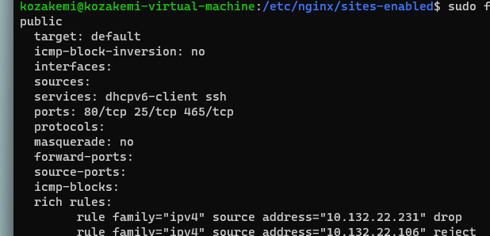

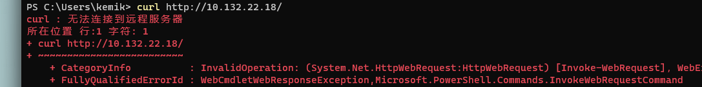

解ban：

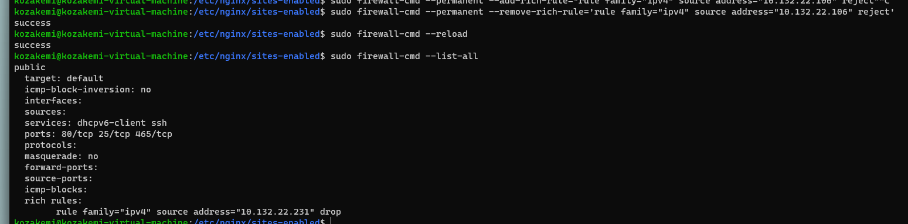

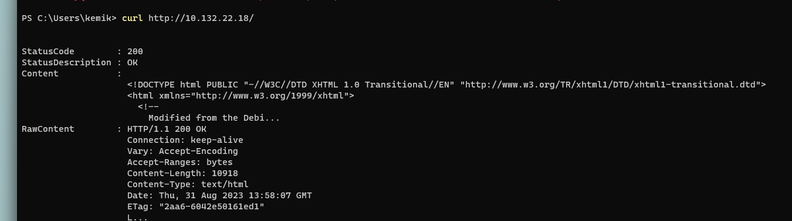

#### 3、最终结果

apache2使用8080端口

编写网页hello.html

使用nginx将8080反代到80

ban掉除80与ssh相关的端口

ban掉教师ip`10.132.22.231`

ban掉测试ban ip`10.132.22.249`

对放开ip`10.132.22.65`不做处理

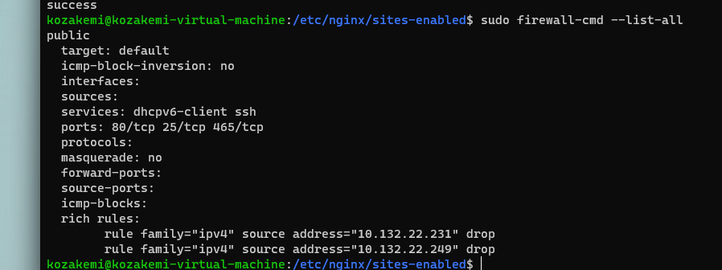

