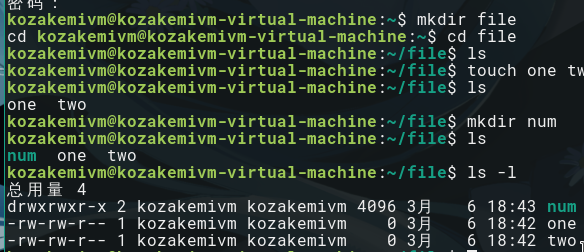
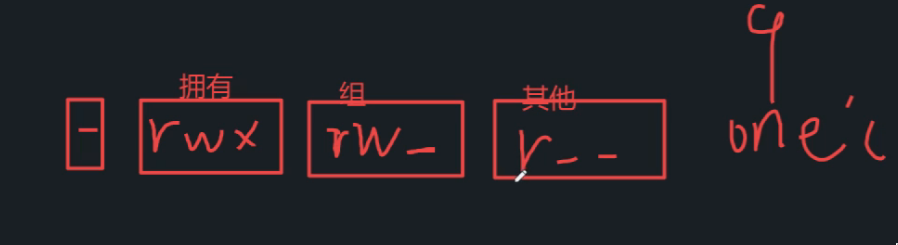
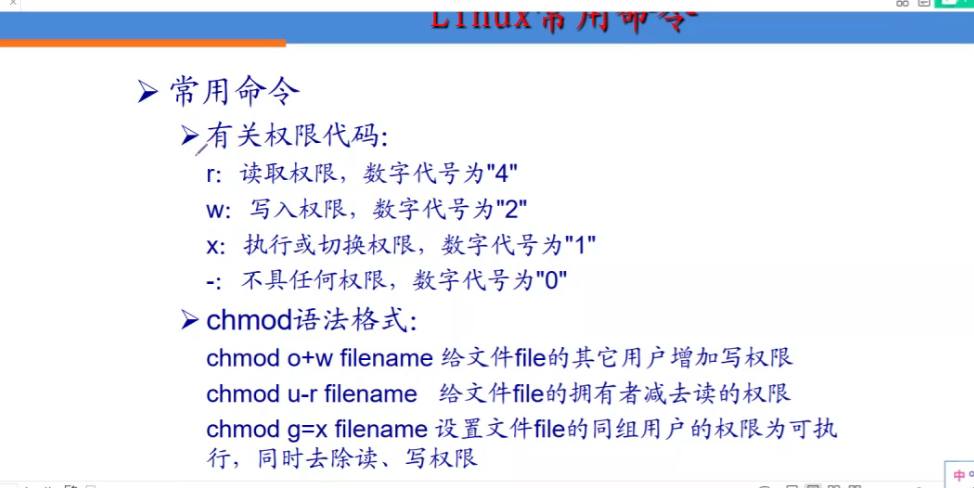
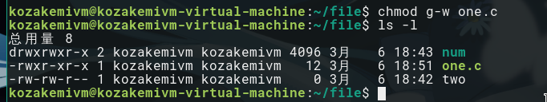
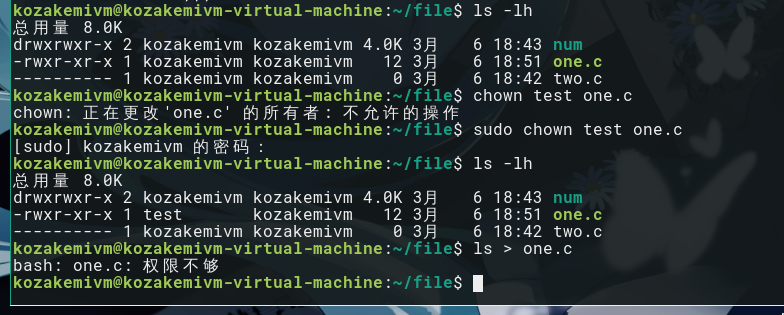

## 用户管理

### 添加用户 adduser

增建用户

```shell
sudo adduser username
```

### 删除用户 deluser

删除用户

```shell
sudo deluser username
```

### 修改密码 passwd

修改用户密码

修改本用户

```shell
passwd
```

修改其他用户，提权或切换root执行

```shell
sudo passwd username
```

*

```shell
cat /etc/passwd
```

查看本机用户详情

```shell
kozakemivm@kozakemivm-virtual-machine:~/file$ cat /etc/passwd
root:x:0:0:root:/root:/bin/bash
daemon:x:1:1:daemon:/usr/sbin:/usr/sbin/nologin
bin:x:2:2:bin:/bin:/usr/sbin/nologin
sys:x:3:3:sys:/dev:/usr/sbin/nologin
sync:x:4:65534:sync:/bin:/bin/sync
games:x:5:60:games:/usr/games:/usr/sbin/nologin
man:x:6:12:man:/var/cache/man:/usr/sbin/nologin
lp:x:7:7:lp:/var/spool/lpd:/usr/sbin/nologin
mail:x:8:8:mail:/var/mail:/usr/sbin/nologin
news:x:9:9:news:/var/spool/news:/usr/sbin/nologin
uucp:x:10:10:uucp:/var/spool/uucp:/usr/sbin/nologin
proxy:x:13:13:proxy:/bin:/usr/sbin/nologin
www-data:x:33:33:www-data:/var/www:/usr/sbin/nologin
backup:x:34:34:backup:/var/backups:/usr/sbin/nologin
list:x:38:38:Mailing List Manager:/var/list:/usr/sbin/nologin
irc:x:39:39:ircd:/var/run/ircd:/usr/sbin/nologin
gnats:x:41:41:Gnats Bug-Reporting System (admin):/var/lib/gnats:/usr/sbin/nologin
nobody:x:65534:65534:nobody:/nonexistent:/usr/sbin/nologin
systemd-network:x:100:102:systemd Network Management,,,:/run/systemd/netif:/usr/sbin/nologin
systemd-resolve:x:101:103:systemd Resolver,,,:/run/systemd/resolve:/usr/sbin/nologin
syslog:x:102:106::/home/syslog:/usr/sbin/nologin
messagebus:x:103:107::/nonexistent:/usr/sbin/nologin
_apt:x:104:65534::/nonexistent:/usr/sbin/nologin
uuidd:x:105:111::/run/uuidd:/usr/sbin/nologin
avahi-autoipd:x:106:112:Avahi autoip daemon,,,:/var/lib/avahi-autoipd:/usr/sbin/nologin
usbmux:x:107:46:usbmux daemon,,,:/var/lib/usbmux:/usr/sbin/nologin
dnsmasq:x:108:65534:dnsmasq,,,:/var/lib/misc:/usr/sbin/nologin
rtkit:x:109:114:RealtimeKit,,,:/proc:/usr/sbin/nologin
cups-pk-helper:x:110:116:user for cups-pk-helper service,,,:/home/cups-pk-helper:/usr/sbin/nologin
speech-dispatcher:x:111:29:Speech Dispatcher,,,:/var/run/speech-dispatcher:/bin/false
whoopsie:x:112:117::/nonexistent:/bin/false
kernoops:x:113:65534:Kernel Oops Tracking Daemon,,,:/:/usr/sbin/nologin
saned:x:114:119::/var/lib/saned:/usr/sbin/nologin
avahi:x:115:120:Avahi mDNS daemon,,,:/var/run/avahi-daemon:/usr/sbin/nologin
colord:x:116:121:colord colour management daemon,,,:/var/lib/colord:/usr/sbin/nologin
hplip:x:117:7:HPLIP system user,,,:/var/run/hplip:/bin/false
geoclue:x:118:122::/var/lib/geoclue:/usr/sbin/nologin
pulse:x:119:123:PulseAudio daemon,,,:/var/run/pulse:/usr/sbin/nologin
gnome-initial-setup:x:120:65534::/run/gnome-initial-setup/:/bin/false
gdm:x:121:125:Gnome Display Manager:/var/lib/gdm3:/bin/false
kozakemivm:x:1000:1000:kozakemiVM,,,:/home/kozakemivm:/bin/bash
sshd:x:122:65534::/run/sshd:/usr/sbin/nologin
www:x:1002:1002::/home/www:/sbin/nologin
smmta:x:123:127:Mail Transfer Agent,,,:/var/lib/sendmail:/usr/sbin/nologin
smmsp:x:124:128:Mail Submission Program,,,:/var/lib/sendmail:/usr/sbin/nologin
mysql:x:1003:1003::/home/mysql:/sbin/nologin
test:x:1001:1001:,,,:/home/test:/bin/bash
```

### 切换用户 su

变更用户身份

```shell
su test
```


## 权限管理

### 权限验证 chmod

在目录中以当前用户创建文件与文件夹



 权限 所有者 所有者组 大小 时间 文件名

#### 三种文件控制

1、读 r

2、写 w

3、可执行 x

​	即可编译，运行

#### 三种角色

1、拥有者

2、组

​	即同组成员

3、其他

```shell
kozakemivm@kozakemivm-virtual-machine:~/file$ ls -l
总用量 4
drwxrwxr-x 2 kozakemivm kozakemivm 4096 3月   6 18:43 num
-rw-rw-r-- 1 kozakemivm kozakemivm    0 3月   6 18:42 one
-rw-rw-r-- 1 kozakemivm kozakemivm    0 3月   6 18:42 two
```

位1,文件类型

d文件夹  - 普通文件

位234,  拥有者权限

位567,  组权限

位89x,  其他用户权限



案例解析：

普通文件,读写执行,读写 ,读

#### chmod 两种使用方法

改变文件权限



##### 1、字母法

可单个修改也可批量修改

拥有者 u（user） 组g  其他o   全部 a（all）

为所用用户添加可执行权限

```shell
chmod a+x one.c 
```


删除同组可写权限

```shell
chmod g-w one.c
```



##### 2、数字法

可批量修改

原理：由三位二进制控制

r=4 w=2 x=1 -=0

修改two.c 所有角色都可读写执行

```shell
chmod 777 two.c
```

### 修改文件所属人 chown

修改one.c的所有者

需提权操作

```shell
sudo chown username filename
```




### 修改同组 chgrp

修改文件的所有者

需提权操作

```shell
sudo chgrp username filename 
```

