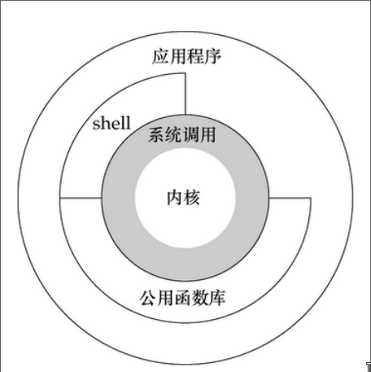

## 软连接与硬连接

### 软连接

```shell
ln -s file file.s #ln [选项]... [-T] 目标 链接名
```

类似于windows的快捷方式，file.s中存储的是访问路径,但是是相对的，如果将file.s的位置移动后，无法使用，如果想要使用绝对路径，则使用绝对路径创建

```shell
ln -s /home/kozakemi/test/linux_shell/file file.soft
```

这样操作后任意位置均可访问，因此，为了创建软连接是，尽量使用绝对路径创建软连接

实际上其原理为软连接文件存储的是路径

创建的软连接，文件名与日期均不同

文件类型为l

### 硬连接

创建的软连接权限为全开放，但是文件是否可被操作，是由源文件决定

```shell
ln file file.h  
```

这两个文件任意修改一个，均会更改源文件，文件名不同，而日期一致

原理是两个文件为Inode一致，因此修改一个文件时，会同时修改是有的Inode一致的文件，及硬连接的文件，linux为每个文件赋予唯一的Inode

当删除时就不是这个问题，做法是将硬连接计数减1

文件类型由源文件决定

## 系统调用

系统调用函数属于操作系统的一部分，是为了提供给用户进行操作的接口（API函数），使得用户态运行的进程与硬件设备(如CPU、磁盘、打印机、显示器)等进行交互。



## man 

太男人了

这是一个非常好用的工具，在linux查询c库与系统调用十分便捷

```shell
man man 
```

```shell
1   可执行程序或 shell 命令
2   系统调用(内核提供的函数)
3   库调用(程序库中的函数)
4   特殊文件(通常位于 /dev)
5   文件格式和规范，如  /etc/passwd
6   游戏
7   杂项（包括宏包和规范）， 如 man(7)，groff(7), man-pages(7)
8   系统管理命令(通常只针对 root 用户)
9   内核例程 [非标准
```


## 文件IO

### open()

#### 概述

open, creat - 打开和/或创建一个文件

```c
#include <sys/types.h>
#include <sys/stat.h>
#include <fcntl.h>

int open(const char *pathname, int flags);
int open(const char *pathname, int flags, mode_t mode)
int creat(const char *pathname, mode_t mode);
```

#### 参数

参数 `pathname` 为文件路径

`flages`是通过 `O_RDONLY`, `O_WRONLY` 或 `O_RDWR` (指明 文件 是以 只读 , 只写 或 读写 方式  打开的)与下面的 零个 或 多个 可选模式 按位 -or 操作 得到的

```shell
       O_CREAT
             若文件 不存在 将 创建 一个 新 文件.  新 文件 的 属主 (用户ID) 被 设置 为 此 程序 的 有效 用户
             的 ID.  同样 文件 所属 分组 也 被 设置 为 此 程序 的 有效 分组 的 ID 或者 上层 目录  的  分组
             ID  (这 依赖 文件系统 类型 ,装载选项 和 上层目录 的 模式, 参考,在 mount(8) 中 描述 的 ext2 文
                  件系统 的 装载选项 bsdgroups 和 sysvgroups )
       O_APPEND
              文件  以  追加  模式  打开  . 在 写 以前 , 文件 读写 指针 被 置 在 文件 的 末尾 .  as if with
              lseek.  O_APPEND may lead to corrupted files on NFS file systems if  more  than  one  process
              appends data to a file at once.  This is because NFS does not support appending to a file, so
              the client kernel has to simulate it, which can't be done without a race condition.
              
#其余详见`man 2 open` 
```

`mode`创建文件时指定权限

```shell
S_IRWXU
00700 允许 文件 的 属主 读 , 写 和 执行 文件

S_IRUSR (S_IREAD)
00400 允许 文件 的 属主 读 文件

S_IWUSR (S_IWRITE)
00200 允许 文件 的 属主 写 文件
#其余详见`man 2 open` 
```

#### 返回值

返回值为int类型，一般从3开始递增，

- 文件描述符 0：标准输入（stdin）
- 文件描述符 1：标准输出（stdout）
- 文件描述符 2：标准错误输出（stderr）

以上三个描述符被系统占用，因此一般从3开始，例如下面的示例代码

#### 示例代码

```c
#include <unistd.h>
#include <sys/types.h>
#include <sys/stat.h>
#include <fcntl.h>
#include <stdio.h>
#include <errno.h>
#include <string.h>
int main() {
  int fd;

  // Open "tmp.txt" file in write-only mode
  fd = open("tmp.txt", O_WRONLY);
  if (fd == -1) {
    perror("Error opening tmp.txt");
    printf("Error opening tmp.txt: %s\n",strerror(errno));
  }
  printf("%d\n", fd);

  // Open "tmp.txt" file in append mode for writing
  fd = open("tmp.txt", O_WRONLY | O_APPEND);
  if (fd == -1) {
    perror("Error opening tmp.txt");
    printf("Error opening tmp.txt: %s\n",strerror(errno));
  }
  printf("%d\n", fd);

  // Open "Fol.txt" file in read-only mode, create if it doesn't exist with permissions 0777
  fd = open("Fol.txt", O_RDONLY | O_CREAT, 0777);//8进制0开头
  if (fd == -1) {
    perror("Error opening Fol.txt");
    printf("Error opening Fol.txt: %s\n",strerror(errno));
  }
  printf("%d\n", fd);

  return 0;
}
```

目录文件结构

```shell
[kozakemi@kozakemi-arch linux_ccode]$ ls -l                                       
总计 8
-rw-r--r-- 1 kozakemi kozakemi   6 10月16日 23:29 1.txt
-rw-r--r-- 1 kozakemi kozakemi 563 10月16日 23:50 file_w.c
-rwxr-xr-x 1 kozakemi kozakemi   0 10月16日 23:46 Fol.txt
-rw-r--r-- 1 kozakemi kozakemi   0 10月16日 23:47 tmp.txt
```

执行结果

```shell
[kozakemi@kozakemi-arch linux_ccode]$ gcc '/home/kozakemi/test/linux_ccode/file_w.c' && ./a.out 
3
4
5
```


### write()

#### 概述

在一个文件描述符上执行写操作

```c
#include <unistd.h>

ssize_t write(int fd, const void *buf, size_t count);
```

#### 参数

`fd`文件描述符，open的返回值

`buf`写入的字符串

`count`写入的大小

#### 返回值

`ssize_t`为写入的字节数

#### 示例代码

```c
#include <sys/types.h>
#include <sys/stat.h>
#include <fcntl.h>
#include <stdio.h>

#include <unistd.h>
#include <errno.h>
#include <string.h>
int main() {
  int fd;
  ssize_t strno;
  fd=open("Fol.txt",O_WRONLY|O_APPEND);
  char infile_str[]="asdasdasd\n";
  if(-1==fd)
  {
    printf("error Fol.txt: %s",strerror(errno));
    perror("Fol.txt");
  }else{
    strno=write(fd, infile_str, strlen(infile_str));
    printf("%d=%d=%d-1",strno,strlen(infile_str),sizeof(infile_str));
  }
  return 0;
}
```

### read()

#### 概述

在文件描述符上执行读操作

```c
#include <unistd.h>

ssize_t read(int fd, void *buf, size_t count);
```

#### 参数

`fd`文件描述符，open的返回值

`buf`读出的字符串

`count`读出的大小

* 需要注意的是`count`不要大于`buf`值(必定报错`[1]    17806 IOT instruction (core dumped)` )，更不要大于文件中内容的大小否则会出现不可预料的错误(虽然我测试时未遇到)

#### 返回值

`ssize_t`为读出的字节数

#### 示例代码

```c
#include <sys/types.h>
#include <sys/stat.h>
#include <fcntl.h>
#include <stdio.h>

#include <unistd.h>
#include <errno.h>
#include <string.h>
int main() {
  int fd;
  ssize_t strno;
  int readsize=10;
  fd=open("Fol.txt",O_RDONLY);
  char file_oustr[20]="";
  if(-1==fd)
  {
    printf("error Fol.txt: %s",strerror(errno));
    perror("Fol.txt");
  }else{
    strno=read(fd, file_oustr, readsize);
    printf("%d,%s",strno,file_oustr);
  }
  
  return 0;
}
```

### close()

#### 概述

关闭一个文件描述符

```c
#include <unistd.h>

int close(int fd);
```

#### 参数

`fd`文件描述符

#### 返回值

`-1`为关闭失败，`0`为关闭成功

#### 示例代码

```c
#include <unistd.h>  
。。。
fd=open("Fol.txt",O_RDONLY);
。。。
if(-1==close(fd)){
    printf("error close file: %s",strerror(errno));
    return -1;
}
```

### lseek()

这是一个系统调用

#### 概述

修改文件的描述符，偏移位置

```c
#include <unistd.h>

off_t lseek(int fd, off_t offset, int whence);
```

#### 参数

`fd`文件描述符

`offset`偏移量

`whence`偏移方式　

> - `SEEK_SET`:偏移到文件头+ 设置的偏移量
> - `SEEK_CUR`：偏移到当前位置+设置的偏移量
> - `SEEK_END`：偏移到文件尾置+设置的偏移量

#### 返回值

`off_t`设置之后的文件偏移量，操作失败时返回`-1`，成功后返回偏移量

#### 示例程序

查看当前的位置

```c
#include <fcntl.h>
#include <stdio.h>

#include <unistd.h>
#include <errno.h>
int main() {
  int fd,ret;
  fd=open("Fol.txt",O_RDWR);
  ret=lseek(fd,0,SEEK_CUR);
  printf("%d\n",ret);
  perror("lseek");
  return 0;
}
```

查看文件大小

```c
#include <fcntl.h>
#include <stdio.h>

#include <unistd.h>
#include <errno.h>
int main() {
  int fd,ret;
  fd=open("Fol.txt",O_RDWR);
  ret=lseek(fd,0,SEEK_END);
  printf("%d\n",ret);
  perror("lseek");
  return 0;
}
```

将字符串插入到指定的位置后

```c
#include <unistd.h>
#include <sys/types.h>
#include <sys/stat.h>
#include <fcntl.h>
#include <stdio.h>
#include <string.h>

int main()
{
  int fd,ret;
  char a[]="JMU WELCOME";
  fd=open("hello1.txt",O_RDWR|O_CREAT,0777);
  ret=lseek(fd,1000,SEEK_END);
  write(fd,a,strlen(a));
  printf("%d\n",ret);
  return 0;
}
```

