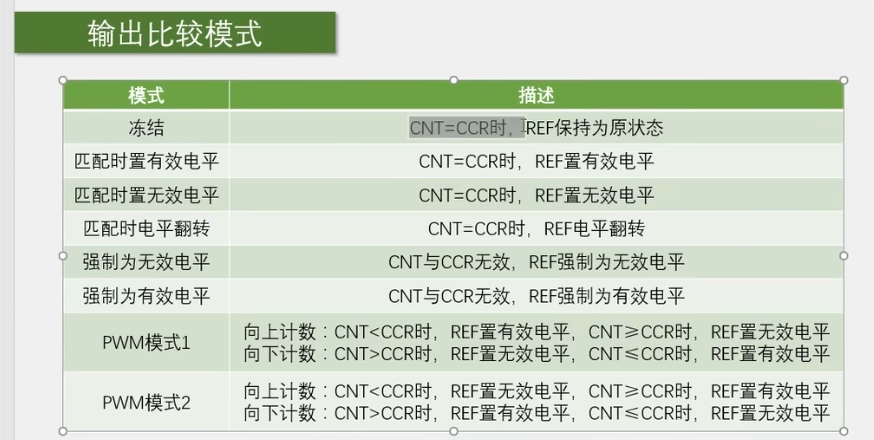
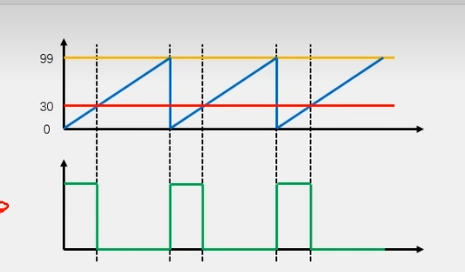
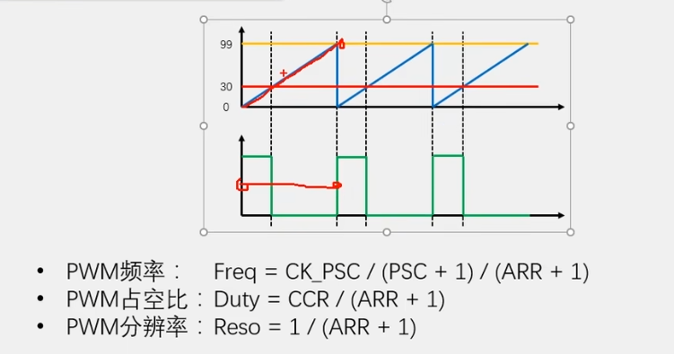

【STM32入门教程-2023持续更新中】https://www.bilibili.com/video/BV1th411z7sn?p=16&vd_source=a72069186a610509925b0932bb49f8cc

## pwm的三个参数

频率、占空比、幅值

## 输出比较模式







上图 ARR=99 CCR=29

## 输出比较模块配置函数

```c
/*四个比较单元、四个比较模块配置函数、*/
void TIM_OC1Init(TIM_TypeDef* TIMx, TIM_OCInitTypeDef* TIM_OCInitStruct);
void TIM_OC2Init(TIM_TypeDef* TIMx, TIM_OCInitTypeDef* TIM_OCInitStruct);
void TIM_OC3Init(TIM_TypeDef* TIMx, TIM_OCInitTypeDef* TIM_OCInitStruct);
void TIM_OC4Init(TIM_TypeDef* TIMx, TIM_OCInitTypeDef* TIM_OCInitStruct);
/*为结构体赋值初值*/
void TIM_OCStructInit(TIM_OCInitTypeDef* TIM_OCInitStruct);
/*配置CCR寄存器预装功能*/
void TIM_OC1PreloadConfig(TIM_TypeDef* TIMx, uint16_t TIM_OCPreload);
void TIM_OC2PreloadConfig(TIM_TypeDef* TIMx, uint16_t TIM_OCPreload);
void TIM_OC3PreloadConfig(TIM_TypeDef* TIMx, uint16_t TIM_OCPreload);
void TIM_OC4PreloadConfig(TIM_TypeDef* TIMx, uint16_t TIM_OCPreload);
/*修改输出使能参数*/
void TIM_OC4PolarityConfig(TIM_TypeDef* TIMx, uint16_t TIM_OCPolarity);
void TIM_CCxCmd(TIM_TypeDef* TIMx, uint16_t TIM_Channel, uint16_t TIM_CCx);
/*设置输出比较模式*/
void TIM_SelectOCxM(TIM_TypeDef* TIMx, uint16_t TIM_Channel, uint16_t TIM_OCMode);
/*更改CCR寄存器值*/
void TIM_SetCompare1(TIM_TypeDef* TIMx, uint16_t Compare1);
void TIM_SetCompare2(TIM_TypeDef* TIMx, uint16_t Compare2);
void TIM_SetCompare3(TIM_TypeDef* TIMx, uint16_t Compare3);
void TIM_SetCompare4(TIM_TypeDef* TIMx, uint16_t Compare4);

/*仅高级定时器使用*/
void TIM_CtrlPWMOutputs(TIM_TypeDef* TIMx, FunctionalState NewState);
/*配置强制输出模式*/
void TIM_ForcedOC1Config(TIM_TypeDef* TIMx, uint16_t TIM_ForcedAction);
void TIM_ForcedOC2Config(TIM_TypeDef* TIMx, uint16_t TIM_ForcedAction);
void TIM_ForcedOC3Config(TIM_TypeDef* TIMx, uint16_t TIM_ForcedAction);
void TIM_ForcedOC4Config(TIM_TypeDef* TIMx, uint16_t TIM_ForcedAction);
/*配置快速使能*/
void TIM_OC1FastConfig(TIM_TypeDef* TIMx, uint16_t TIM_OCFast);
void TIM_OC2FastConfig(TIM_TypeDef* TIMx, uint16_t TIM_OCFast);
void TIM_OC3FastConfig(TIM_TypeDef* TIMx, uint16_t TIM_OCFast);
void TIM_OC4FastConfig(TIM_TypeDef* TIMx, uint16_t TIM_OCFast);
/*外部事件时清除REF信号*/
void TIM_ClearOC1Ref(TIM_TypeDef* TIMx, uint16_t TIM_OCClear);
void TIM_ClearOC2Ref(TIM_TypeDef* TIMx, uint16_t TIM_OCClear);
void TIM_ClearOC3Ref(TIM_TypeDef* TIMx, uint16_t TIM_OCClear);
void TIM_ClearOC4Ref(TIM_TypeDef* TIMx, uint16_t TIM_OCClear);
/*设置输出比较极性*/
void TIM_OC1PolarityConfig(TIM_TypeDef* TIMx, uint16_t TIM_OCPolarity);
void TIM_OC1NPolarityConfig(TIM_TypeDef* TIMx, uint16_t TIM_OCNPolarity);
void TIM_OC2PolarityConfig(TIM_TypeDef* TIMx, uint16_t TIM_OCPolarity);
void TIM_OC2NPolarityConfig(TIM_TypeDef* TIMx, uint16_t TIM_OCNPolarity);
void TIM_OC3PolarityConfig(TIM_TypeDef* TIMx, uint16_t TIM_OCPolarity);
void TIM_OC3NPolarityConfig(TIM_TypeDef* TIMx, uint16_t TIM_OCNPolarity);
void TIM_OC4PolarityConfig(TIM_TypeDef* TIMx, uint16_t TIM_OCPolarity);
```


## 配置PWM波输出

### 复制[STM32 TIM定时器](https://kozakemi.gitlab.io/post/12e3998c.html)配置使用内部时钟的代码，作出以下修改

```c
RCC_APB1PeriphClockCmd(RCC_APB1Periph_TIM2, ENABLE);

TIM_InternalClockConfig(TIM2);

TIM_TimeBaseInitTypeDef TIM_TimeBaseInitStructure;
TIM_TimeBaseInitStructure.TIM_ClockDivision = TIM_CKD_DIV1;
TIM_TimeBaseInitStructure.TIM_CounterMode = TIM_CounterMode_Up;
TIM_TimeBaseInitStructure.TIM_Period = 10000 - 1;  //ARR
TIM_TimeBaseInitStructure.TIM_Prescaler = 7200 - 1;  //PSC
TIM_TimeBaseInitStructure.TIM_RepetitionCounter = 0;
TIM_TimeBaseInit(TIM2, &TIM_TimeBaseInitStructure);
/*
TIM_ClearFlag(TIM2, TIM_FLAG_Update);//防止初始化时进入中断
TIM_ITConfig(TIM2, TIM_IT_Update, ENABLE);

NVIC_PriorityGroupConfig(NVIC_PriorityGroup_2);

NVIC_InitTypeDef NVIC_InitStructure;
NVIC_InitStructure.NVIC_IRQChannel = TIM2_IRQn;
NVIC_InitStructure.NVIC_IRQChannelCmd = ENABLE;
NVIC_InitStructure.NVIC_IRQChannelPreemptionPriority = 2;
NVIC_InitStructure.NVIC_IRQChannelSubPriority = 1;
NVIC_Init(&NVIC_InitStructure);
*/
TIM_Cmd(TIM2, ENABLE);
```

### 配置OC

```c
/**
  * @brief  Initializes the TIMx Channel1 according to the specified
  *         parameters in the TIM_OCInitStruct.
  * @param  TIMx: where x can be  1 to 17 except 6 and 7 to select the TIM peripheral.
  * @param  TIM_OCInitStruct: pointer to a TIM_OCInitTypeDef structure
  *         that contains the configuration information for the specified TIM peripheral.
  * @retval None
  */
void TIM_OC1Init(TIM_TypeDef* TIMx, TIM_OCInitTypeDef* TIM_OCInitStruct)
```

> 参数1、TIMx
>
> 参数2、TIM_OCInitTypeDef结构体

结构体内容

```c
/** 
  * @brief  TIM Output Compare Init structure definition  
  */

typedef struct
{
  uint16_t TIM_OCMode;        /*!< Specifies the TIM mode.
                                   This parameter can be a value of @ref TIM_Output_Compare_and_PWM_modes */

  uint16_t TIM_OutputState;   /*!< Specifies the TIM Output Compare state.
                                   This parameter can be a value of @ref TIM_Output_Compare_state */

  uint16_t TIM_OutputNState;  /*!< Specifies the TIM complementary Output Compare state.
                                   This parameter can be a value of @ref TIM_Output_Compare_N_state
                                   @note This parameter is valid only for TIM1 and TIM8. */

  uint16_t TIM_Pulse;         /*!< Specifies the pulse value to be loaded into the Capture Compare Register. 
                                   This parameter can be a number between 0x0000 and 0xFFFF */

  uint16_t TIM_OCPolarity;    /*!< Specifies the output polarity.
                                   This parameter can be a value of @ref TIM_Output_Compare_Polarity */

  uint16_t TIM_OCNPolarity;   /*!< Specifies the complementary output polarity.
                                   This parameter can be a value of @ref TIM_Output_Compare_N_Polarity
                                   @note This parameter is valid only for TIM1 and TIM8. */

  uint16_t TIM_OCIdleState;   /*!< Specifies the TIM Output Compare pin state during Idle state.
                                   This parameter can be a value of @ref TIM_Output_Compare_Idle_State
                                   @note This parameter is valid only for TIM1 and TIM8. */

  uint16_t TIM_OCNIdleState;  /*!< Specifies the TIM Output Compare pin state during Idle state.
                                   This parameter can be a value of @ref TIM_Output_Compare_N_Idle_State
                                   @note This parameter is valid only for TIM1 and TIM8. */
} TIM_OCInitTypeDef;
```

> 首先TIM_OCStructInit(&TIM_OCInitStructure);初始化结构体初始值
>
> TIM_OCMode：设置输出比较的模式
>
> ```c
> /** @defgroup TIM_Output_Compare_and_PWM_modes 
>   * @{
>   */
> 
> #define TIM_OCMode_Timing                  ((uint16_t)0x0000)//冻结模式
> #define TIM_OCMode_Active                  ((uint16_t)0x0010)//相等时置有效电平
> #define TIM_OCMode_Inactive                ((uint16_t)0x0020)//相等时置无效电平
> #define TIM_OCMode_Toggle                  ((uint16_t)0x0030)//相等时反转
> #define TIM_OCMode_PWM1                    ((uint16_t)0x0060)//PWM模式1
> #define TIM_OCMode_PWM2                    ((uint16_t)0x0070)//PWM模式2
> #define IS_TIM_OC_MODE(MODE) (((MODE) == TIM_OCMode_Timing) || \
>                               ((MODE) == TIM_OCMode_Active) || \
>                               ((MODE) == TIM_OCMode_Inactive) || \
>                               ((MODE) == TIM_OCMode_Toggle)|| \
>                               ((MODE) == TIM_OCMode_PWM1) || \
>                               ((MODE) == TIM_OCMode_PWM2))
> #define IS_TIM_OCM(MODE) (((MODE) == TIM_OCMode_Timing) || \
>                           ((MODE) == TIM_OCMode_Active) || \
>                           ((MODE) == TIM_OCMode_Inactive) || \
>                           ((MODE) == TIM_OCMode_Toggle)|| \
>                           ((MODE) == TIM_OCMode_PWM1) || \
>                           ((MODE) == TIM_OCMode_PWM2) ||	\
>                           ((MODE) == TIM_ForcedAction_Active) || \
>                           ((MODE) == TIM_ForcedAction_InActive))
> ```
>
> 比如使用PWM1则 **TIM_OCInitStructure.TIM_OCMode = TIM_OCMode_PWM1;**

> TIM_OCPolarity：设置输出比较的极性
>
> ```c
> /** @defgroup TIM_Output_Compare_Polarity 
>   * @{
>   */
> 
> #define TIM_OCPolarity_High                ((uint16_t)0x0000)//REF电平输出
> #define TIM_OCPolarity_Low                 ((uint16_t)0x0002)//REF电平取反
> #define IS_TIM_OC_POLARITY(POLARITY) (((POLARITY) == TIM_OCPolarity_High) || \
>                                       ((POLARITY) == TIM_OCPolarity_Low))
> ```
>
> 例如 **TIM_OCInitStructure.TIM_OCPolarity = TIM_OCPolarity_High;**

> TIM_OutputState：设置输出使能
>
> ```c
> /** @defgroup TIM_Output_Compare_state 
>   * @{
>   */
> 
> #define TIM_OutputState_Disable            ((uint16_t)0x0000)//启用
> #define TIM_OutputState_Enable             ((uint16_t)0x0001)//禁用
> #define IS_TIM_OUTPUT_STATE(STATE) (((STATE) == TIM_OutputState_Disable) || \
>                                     ((STATE) == TIM_OutputState_Enable))
> ```
>
> **TIM_OCInitStructure.TIM_OutputState = TIM_OutputState_Enable;**

> TIM_Pulse：设置CCR寄存器值
>
> ```c
> uint16_t TIM_Pulse;         /*!< Specifies the pulse value to be loaded into the Capture Compare Register. 
>                                    This parameter can be a number between 0x0000 and 0xFFFF */
> ```
>
> 值为CCR的值，值的范围为 0x0000 ~ 0xFFFF

### 配置GPIO口输出PWM

查表的使用PA0输出PWM

```c
RCC_APB2PeriphClockCmd(RCC_APB2Periph_GPIOA, ENABLE);、

GPIO_InitTypeDef GPIO_InitStructure;
GPIO_InitStructure.GPIO_Mode = GPIO_Mode_AF_PP;//复用推挽
GPIO_InitStructure.GPIO_Pin = GPIO_Pin_0;	
GPIO_InitStructure.GPIO_Speed = GPIO_Speed_50MHz;
GPIO_Init(GPIOA, &GPIO_InitStructure);
```

### 总览

```c
RCC_APB1PeriphClockCmd(RCC_APB1Periph_TIM2, ENABLE);
RCC_APB2PeriphClockCmd(RCC_APB2Periph_GPIOA, ENABLE);

GPIO_InitTypeDef GPIO_InitStructure;
GPIO_InitStructure.GPIO_Mode = GPIO_Mode_AF_PP;
GPIO_InitStructure.GPIO_Pin = GPIO_Pin_0;	
GPIO_InitStructure.GPIO_Speed = GPIO_Speed_50MHz;
GPIO_Init(GPIOA, &GPIO_InitStructure);

TIM_InternalClockConfig(TIM2);

TIM_TimeBaseInitTypeDef TIM_TimeBaseInitStructure;
TIM_TimeBaseInitStructure.TIM_ClockDivision = TIM_CKD_DIV1;
TIM_TimeBaseInitStructure.TIM_CounterMode = TIM_CounterMode_Up;
TIM_TimeBaseInitStructure.TIM_Period = 100 - 1;		//ARR定时器的计数范围
TIM_TimeBaseInitStructure.TIM_Prescaler = 720 - 1;		//PSC预分频器的值
TIM_TimeBaseInitStructure.TIM_RepetitionCounter = 0;
TIM_TimeBaseInit(TIM2, &TIM_TimeBaseInitStructure);

TIM_OCInitTypeDef TIM_OCInitStructure;
TIM_OCStructInit(&TIM_OCInitStructure);
TIM_OCInitStructure.TIM_OCMode = TIM_OCMode_PWM1;
TIM_OCInitStructure.TIM_OCPolarity = TIM_OCPolarity_High;
TIM_OCInitStructure.TIM_OutputState = TIM_OutputState_Enable;
TIM_OCInitStructure.TIM_Pulse = 0;		//CCR 控制占空比
TIM_OC1Init(TIM2, &TIM_OCInitStructure);

TIM_Cmd(TIM2, ENABLE);
```

## 如何修改其占空比

占空比由ARR和CCR决定

Duty=CCR/(ARR+1)

所以修改CCR可以修改占空比

使用**TIM_SetCompare1( )**可以修改占空比，删除**TIM_OCInitStructure.TIM_Pulse = 0;**，使用函数控制占空比

```c
/**
  * @brief  Sets the TIMx Capture Compare1 Register value
  * @param  TIMx: where x can be 1 to 17 except 6 and 7 to select the TIM peripheral.
  * @param  Compare1: specifies the Capture Compare1 register new value.
  * @retval None
  */
void TIM_SetCompare1(TIM_TypeDef* TIMx, uint16_t Compare1)
```

> 参数1、TIMx
>
> 参数2、CRR值

例如

```c
TIM_SetCompare1(TIM2, 100);//修改通道1的CCR值
```

## 如何修改频率

```c
/**
  * @brief  Configures the TIMx Prescaler.
  * @param  TIMx: where x can be 1 to 17 to select the TIM peripheral.
  * @param  Prescaler: specifies the Prescaler Register value
  * @param  TIM_PSCReloadMode: specifies the TIM Prescaler Reload mode
  *   This parameter can be one of the following values:
  *     @arg TIM_PSCReloadMode_Update: The Prescaler is loaded at the update event.
  *     @arg TIM_PSCReloadMode_Immediate: The Prescaler is loaded immediately.
  * @retval None
  */
void TIM_PrescalerConfig(TIM_TypeDef* TIMx, uint16_t Prescaler, uint16_t TIM_PSCReloadMode)
```

> 参数1、TIMx
>
> 参数2、Prescaler为PSC的值
>
> 参数3、TIM_PSCReloadMode_Update在更新事件后加载，TIM_PSCReloadMode_Immediate为立即加载

## 引脚占用，如何实现引脚重映射？

此时需要AFIO的功能

### 1、开启AFIO的时钟

```c
RCC_APB2PeriphClockCmd(RCC_APB2Periph_AFIO, ENABLE);
```

### 2、引脚重映射配置

**8.3 表43**

```c
/**
  * @brief  Changes the mapping of the specified pin.
  * @param  GPIO_Remap: selects the pin to remap.
  *   This parameter can be one of the following values:
  *     @arg GPIO_Remap_SPI1             : SPI1 Alternate Function mapping
  *     @arg GPIO_Remap_I2C1             : I2C1 Alternate Function mapping
  *     @arg GPIO_Remap_USART1           : USART1 Alternate Function mapping
  *     @arg GPIO_Remap_USART2           : USART2 Alternate Function mapping
  *     @arg GPIO_PartialRemap_USART3    : USART3 Partial Alternate Function mapping
  *     @arg GPIO_FullRemap_USART3       : USART3 Full Alternate Function mapping
  *     @arg GPIO_PartialRemap_TIM1      : TIM1 Partial Alternate Function mapping
  *     @arg GPIO_FullRemap_TIM1         : TIM1 Full Alternate Function mapping
  *     @arg GPIO_PartialRemap1_TIM2     : TIM2 Partial1 Alternate Function mapping
  *     @arg GPIO_PartialRemap2_TIM2     : TIM2 Partial2 Alternate Function mapping
  *     @arg GPIO_FullRemap_TIM2         : TIM2 Full Alternate Function mapping
  *     @arg GPIO_PartialRemap_TIM3      : TIM3 Partial Alternate Function mapping
  *     @arg GPIO_FullRemap_TIM3         : TIM3 Full Alternate Function mapping
  *     @arg GPIO_Remap_TIM4             : TIM4 Alternate Function mapping
  *     @arg GPIO_Remap1_CAN1            : CAN1 Alternate Function mapping
  *     @arg GPIO_Remap2_CAN1            : CAN1 Alternate Function mapping
  *     @arg GPIO_Remap_PD01             : PD01 Alternate Function mapping
  *     @arg GPIO_Remap_TIM5CH4_LSI      : LSI connected to TIM5 Channel4 input capture for calibration
  *     @arg GPIO_Remap_ADC1_ETRGINJ     : ADC1 External Trigger Injected Conversion remapping
  *     @arg GPIO_Remap_ADC1_ETRGREG     : ADC1 External Trigger Regular Conversion remapping
  *     @arg GPIO_Remap_ADC2_ETRGINJ     : ADC2 External Trigger Injected Conversion remapping
  *     @arg GPIO_Remap_ADC2_ETRGREG     : ADC2 External Trigger Regular Conversion remapping
  *     @arg GPIO_Remap_ETH              : Ethernet remapping (only for Connectivity line devices)
  *     @arg GPIO_Remap_CAN2             : CAN2 remapping (only for Connectivity line devices)
  *     @arg GPIO_Remap_SWJ_NoJTRST      : Full SWJ Enabled (JTAG-DP + SW-DP) but without JTRST
  *     @arg GPIO_Remap_SWJ_JTAGDisable  : JTAG-DP Disabled and SW-DP Enabled
  *     @arg GPIO_Remap_SWJ_Disable      : Full SWJ Disabled (JTAG-DP + SW-DP)
  *     @arg GPIO_Remap_SPI3             : SPI3/I2S3 Alternate Function mapping (only for Connectivity line devices)
  *                                        When the SPI3/I2S3 is remapped using this function, the SWJ is configured
  *                                        to Full SWJ Enabled (JTAG-DP + SW-DP) but without JTRST.   
  *     @arg GPIO_Remap_TIM2ITR1_PTP_SOF : Ethernet PTP output or USB OTG SOF (Start of Frame) connected
  *                                        to TIM2 Internal Trigger 1 for calibration (only for Connectivity line devices)
  *                                        If the GPIO_Remap_TIM2ITR1_PTP_SOF is enabled the TIM2 ITR1 is connected to 
  *                                        Ethernet PTP output. When Reset TIM2 ITR1 is connected to USB OTG SOF output.    
  *     @arg GPIO_Remap_PTP_PPS          : Ethernet MAC PPS_PTS output on PB05 (only for Connectivity line devices)
  *     @arg GPIO_Remap_TIM15            : TIM15 Alternate Function mapping (only for Value line devices)
  *     @arg GPIO_Remap_TIM16            : TIM16 Alternate Function mapping (only for Value line devices)
  *     @arg GPIO_Remap_TIM17            : TIM17 Alternate Function mapping (only for Value line devices)
  *     @arg GPIO_Remap_CEC              : CEC Alternate Function mapping (only for Value line devices)
  *     @arg GPIO_Remap_TIM1_DMA         : TIM1 DMA requests mapping (only for Value line devices)
  *     @arg GPIO_Remap_TIM9             : TIM9 Alternate Function mapping (only for XL-density devices)
  *     @arg GPIO_Remap_TIM10            : TIM10 Alternate Function mapping (only for XL-density devices)
  *     @arg GPIO_Remap_TIM11            : TIM11 Alternate Function mapping (only for XL-density devices)
  *     @arg GPIO_Remap_TIM13            : TIM13 Alternate Function mapping (only for High density Value line and XL-density devices)
  *     @arg GPIO_Remap_TIM14            : TIM14 Alternate Function mapping (only for High density Value line and XL-density devices)
  *     @arg GPIO_Remap_FSMC_NADV        : FSMC_NADV Alternate Function mapping (only for High density Value line and XL-density devices)
  *     @arg GPIO_Remap_TIM67_DAC_DMA    : TIM6/TIM7 and DAC DMA requests remapping (only for High density Value line devices)
  *     @arg GPIO_Remap_TIM12            : TIM12 Alternate Function mapping (only for High density Value line devices)
  *     @arg GPIO_Remap_MISC             : Miscellaneous Remap (DMA2 Channel5 Position and DAC Trigger remapping, 
  *                                        only for High density Value line devices)     
  * @param  NewState: new state of the port pin remapping.
  *   This parameter can be: ENABLE or DISABLE.
  * @retval None
  */
void GPIO_PinRemapConfig(uint32_t GPIO_Remap, FunctionalState NewState)
```

> 参数1、配置映射方式，将PA0映射到PA15，选择部分重映射方式1和完全重映射
>
> 就是 **GPIO_PartialRemap1_TIM2** 或者 **GPIO_FullRemap_TIM2**
>
> 参数2、ENABLE or DISABLE

```
GPIO_PinRemapConfig(GPIO_PartialRemap1_TIM2, ENABLE);
```

但是需要注意的是PA15默认用来作为调试端口，故还需要关闭调试端口的复用

```c
GPIO_PinRemapConfig(GPIO_Remap_SWJ_JTAGDisable, ENABLE);
```

然后将IO由0改为15

```c
GPIO_InitStructure.GPIO_Pin = GPIO_Pin_15;	
```

## 关于同一个定时器的不同通道

同一个定时器不同的通道输出的PWM，频率相同，行为一致，但是占用比可以不同，因为CCR可以独立设定

## 对于控制舵机

建议设置PSC=72，AAR=20k

CCR设置为500~2500

对于上面的参数

```c
PWM_SetCompare2(Angle / 180 * 2000 + 500);
```

上面的代码Angle为度0~180

因为期望为0~180，而CCR的值范围500~2500

对Angle/180得到单位大小，然后*2000得到对应的1度的CCR间隔，再加上500的初始值

即为 <u>Angle / 180 * 2000 + 500</u>
