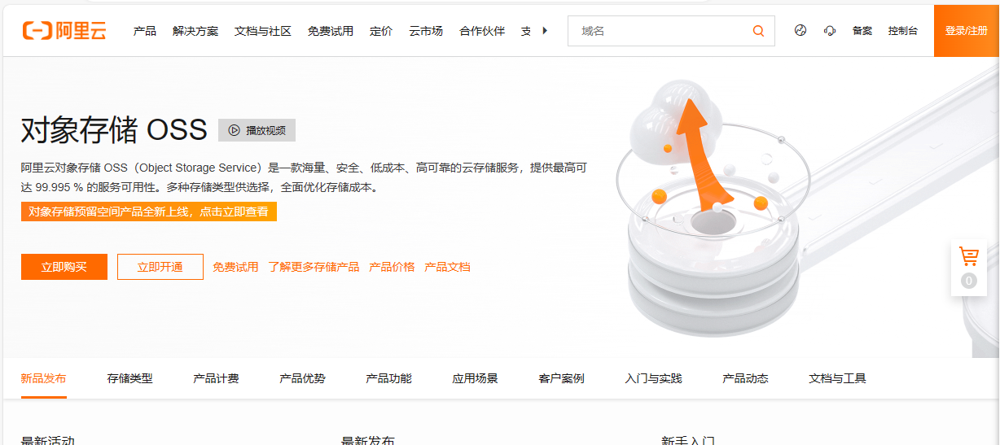
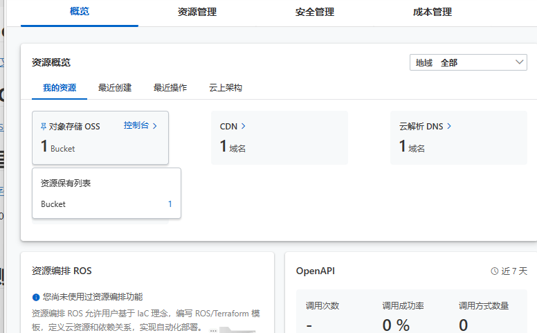
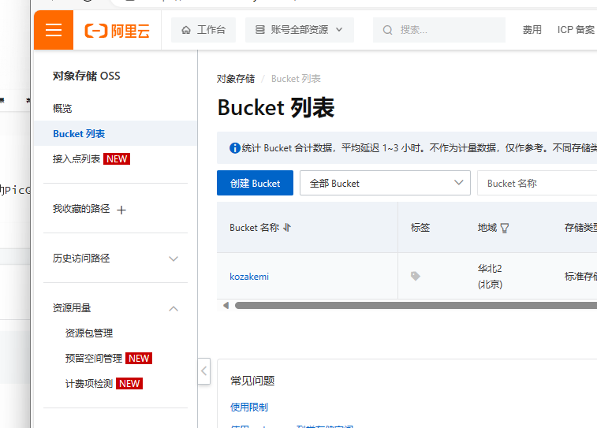
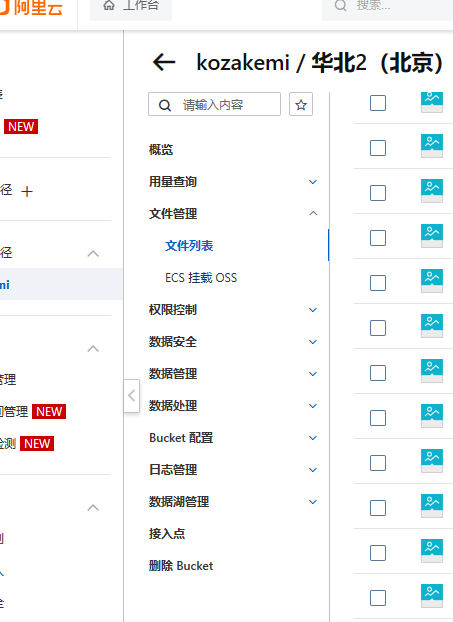
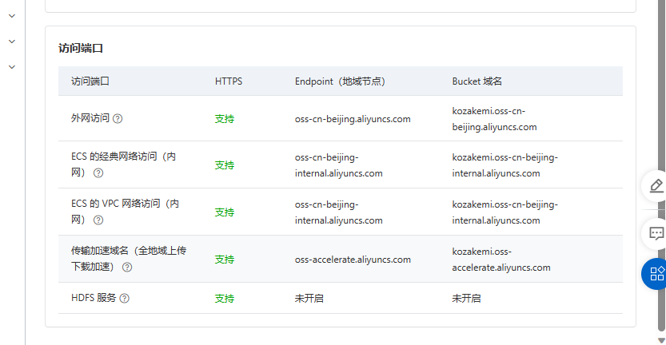
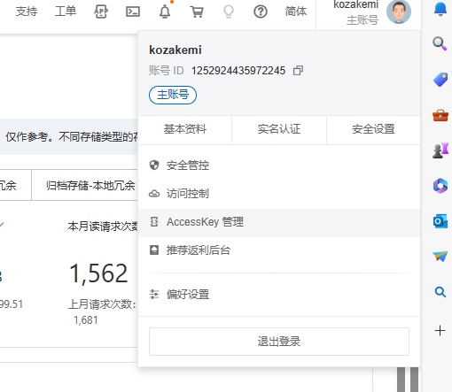
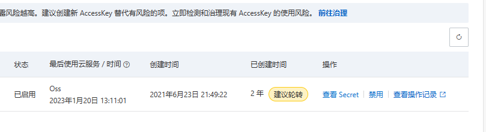
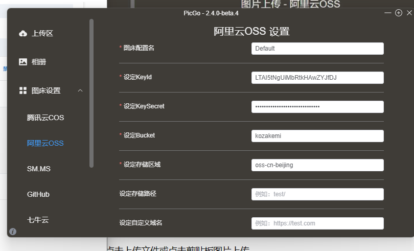
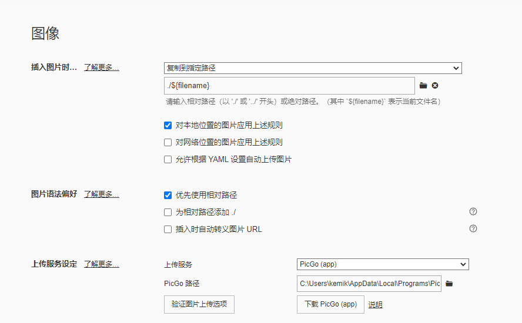
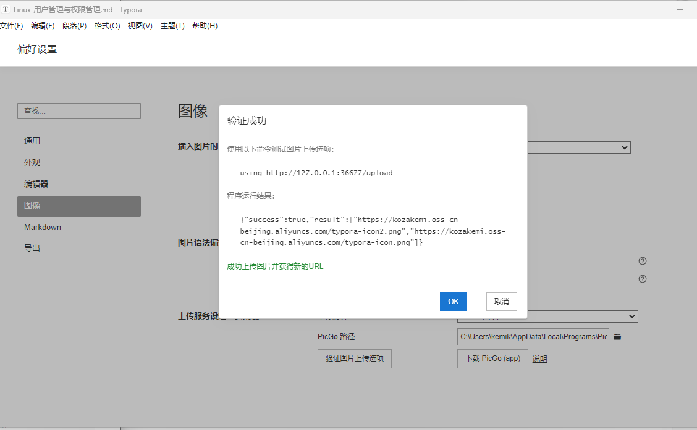

## 参考链接：

[zhihu-阿里云OSS PicGo 配置图床教程 超详细](https://zhuanlan.zhihu.com/p/104152479)

## 安装typora

[Typora官方中文站](https://typoraio.cn/)

## 安装PicGo

[GitHub Release](https://github.com/Molunerfinn/PicGo/releases)

注意记录安装的位置

## 访问阿里云OSS获取信息

1、进入[对象存储页面](https://cn.aliyun.com/product/oss?from_alibabacloud=)，点击右上控制台

2、进入后点击对象存储OSS **控制台**

3、点击左侧栏 **Bucket列表**

4、点击Bucket名称 这里是**kozakemi**

5、点击概览

需要记住以下信息：

6、获取key 右上角 **AccessKey管理**

7、**查看Secret** 并记录内容

## 填写并测试

keyid对应AccessKey ID

KeySecret对应AccessKey Secret

存储空间为Bucket名称

存储区域为外网访问的除去aliyun.com之外的部分：oss-cn-beijing

存储地址自定

自定义域名不填

