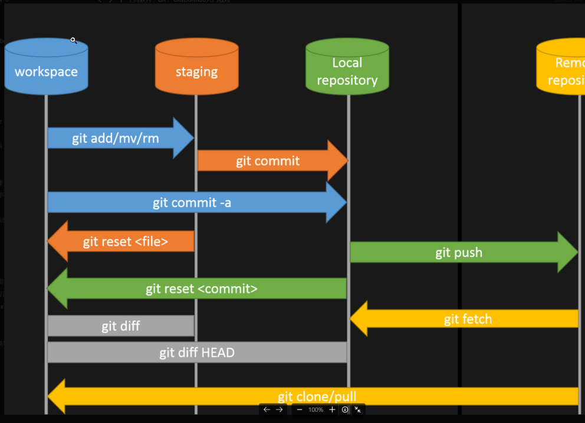

## 代码管理



## 创建git仓库

```shell
git init
```

## 书写代码

书写并保存文件

## 添加文件

```shell
git add .
```

## 添加提交

```shell
git commit -m "<注释>"
```

## 查看当前状态

```shell
git status
```

## 查看提交历史

```c
git log
```

## 查看修改

```c
git diff
```

## 恢复提交

```shell
git reset --hard <hash>
```

## 远程连接

```shell
git remote add origin git@github.com:<username>/<depository name>.git
git branch -M main
git push -u origin main
```

## 创建分支

```shell
git branch <branch-name>
```

## 切换分支

```shell
git checkout  <branch-name>
```

## 删除分支

```shell
git branch -d <branch-name>#删除本地分支

git push origin :<branch-name> #删除远程分支
```

## 提交分支更改

```shell
git push origin <branch-name>
```

