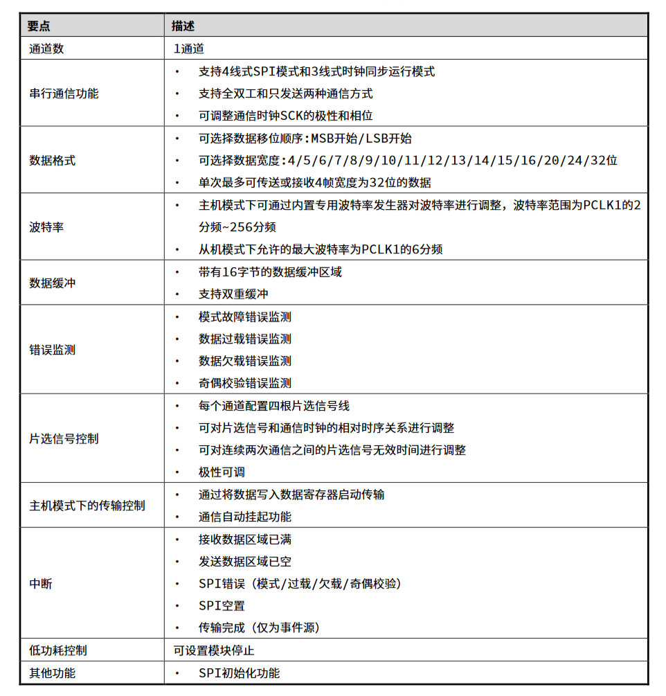
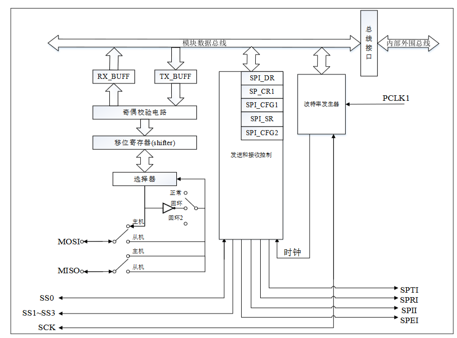
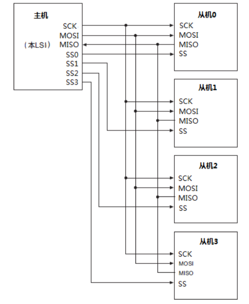
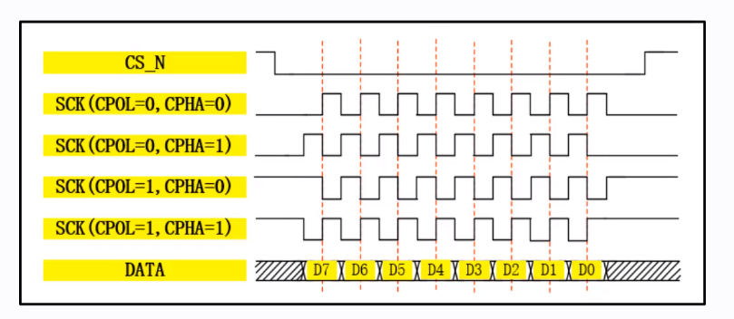

## 支持特性

## 系统框图

从下图来看，波特率发生器产生的SCLK信号由PCLK1时钟生成

## 连接模式

模式由应用场景决定，常用习惯为四线式用在MCU发送，三线式用在MCU接收

> 连接模式的设置由由`stc_spi_init_t`的成员变量`u32WireMode`控制

### 四线式

即`SCLK`、`SS`、`MISO`、`MOSI`

> 文档中的主机模式

### 三线式

即`SCLK`、`MISO`、`MOSI`，取消使用`ss`,使用此模式片选手动设置GPIO电平管理

此模式的妙用为：设置为此模式并设置MCU为从机模式，使用GPIO检查模组的`SS`电平便可以判断一帧数据帧是否发送完毕，以便进行下一步操作

> 文档中的时钟同步运行，并非网上所说的半双工的`三线制`,三线制为`MISO`、`MOSI`复用但是依然有片选控制引脚

## 主从模式

无论主从机管脚输入类型请设定为 CMOS 输入，输出请设定为高驱动力模式，设定请参照【通用 IO（GPIO）】章节通用 IO 特殊寄存器 PCR。

## 波特率

当工作在主机模式，时钟由波特率发生器生成，时钟为PCLK1分频

> 分频由`stc_spi_init_t`的成员变量`u32BaudRatePrescaler`控制

## 数据格式

### 奇偶校验

> 奇偶校验由`stc_spi_init_t`的成员变量`u32Parity`控制

### 四种工作模式

#### 时钟极性（CPOL）

- **CPOL = 0**: 表示时钟在空闲状态时为低电平。当SPI通信开始时，时钟将从低变高。
- **CPOL = 1**: 表示时钟在空闲状态时为高电平。当SPI通信开始时，时钟将从高变低。

#### 时钟相位（CPHA）

- **CPHA = 0**: 表示数据在时钟的第一个边沿（对于CPOL=0是上升沿，对于CPOL=1是下降沿）被采样。
- **CPHA = 1**: 表示数据在时钟的第二个边沿（对于CPOL=0是下降沿，对于CPOL=1是上升沿）被采样。这意味着数据需要在当前时钟周期的第一个边沿之后准备好。

一般常用模式0(flash) /模式1(外设)，下图引用自[通信协议（二）——SPI协议-网速123](http://www.wangsu123.cn/news/27964.html)

> 四种工作模式的设置由由`stc_spi_init_t`的成员变量`u32SpiMode`控制
