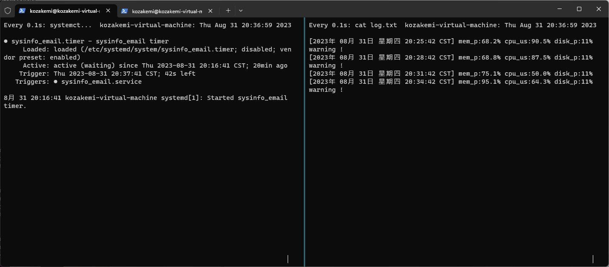

使用的环境为Ubuntu 20.04LTS
## Email发送环境配置

### 1、软件安装

```shell
sudo apt-get install msmtp

sudo apt-get install mutt
```

### 2、配置msmtp

```shell
vim ~/.msmtprc
```

```shell
account default
host smtp.163.com
user kozakemi
from kozakemi@163.com
password VIUXXXXXXXXXXXXS
auth login
tls off
logfile ~/.msmtp.log
```

创建msmtp的日志文件

```shell
touch ~/.msmtp.log
```

### 3、配置muttrc

```shell
vim ~/.muttrc
```

```shell
set envelope_from=yes
set use_from=yes
set from=kozakemi@163.com
set realname="kozakemi"
set sendmail="/usr/bin/msmtp"
```

### 4、测试邮件发送环境

```shell
echo "hello world" | mutt -s "title" kozakemi@petalmail.com
```

首先，查看日志`~/.msmtp.log`

```shell
9月 01 09:13:56 host=smtp.163.com tls=off auth=on user=kozakemi from=kozakemi@163.com recipients=kozakemi@petalmail.com mailsize=516 smtpstatus=250 smtpmsg='250 Mail OK queued as zwqz-smtp-mta-g4-3,_____wCHb4TTOvFkx9JzAw--.10537S2 1693530836' exitcode=EX_OK
```

如果是`smtpstatus=250`,那么问题不大，检查邮箱


## Shell告警脚本书写

### 1、通过top命令获取的消息

#### mem

```shell
top - 19:53:48 up  5:48,  2 users,  load average: 0.00, 0.00, 0.00
任务: 292 total,   1 running, 291 sleeping,   0 stopped,   0 zombie
%Cpu(s):  0.0 us,  0.2 sy,  0.0 ni, 99.8 id,  0.0 wa,  0.0 hi,  0.0 si,  0.0 st
MiB Mem :   3876.4 total,   1182.5 free,   1084.6 used,   1609.3 buff/cache
MiB Swap:   2048.0 total,   2048.0 free,      0.0 used.   2507.1 avail Mem

 进程号 USER      PR  NI    VIRT    RES    SHR    %CPU  %MEM     TIME+ COMMAND
      1 root      20   0  106024  13024   8344 S   0.0   0.3   3:12.58 systemd
```

从其中可以看到内存为MiB Mem :，将`3876.4 total,   1182.5 free`,两者做差再除total得到内存占用率**mem_p**

```shell
mem_total=$(top -b -n 1 | grep "MiB Mem :" | grep -o ".*total"| grep -o -G "[0-9.]\+")
mem_free=$(top -b -n 1 | grep "MiB Mem :" | grep -o "total.*free"| grep -o -G "[0-9.]\+")
dl=$(echo "$mem_total-$mem_free" | bc)
mem_p=$(echo "scale=1;$dl*100/$mem_total" | bc)
```

使用top -b -n 1保证只取一次

grep "MiB Mem :"选中内存行

grep -o ".*total"选中total及以前字符

[0-9.]选中数字和小数点，也就是 3876.4

其中bc是一个计算器，由于shell本身没有计算浮点数的能力，故借助bc计算

#### cpu

cpu最简单，取%Cpu(s)行，取0.0 us,数字就是当前占用站处理器百分比

```shell
cpu_us=$(top -b -n 1 | grep "%Cpu(s)" | grep -o ".*us"| grep -o -G "[0-9.]\+")
```

### 2、使用df命令判断根分区的空间使用情况

首先观察`df /`指令的执行结果

```shell
kozakemi@kozakemi-virtual-machine:~$ df /
文件系统           1K-块    已用     可用 已用% 挂载点
/dev/sda5      102107096 9829744 87044456   11% /
```

shell如下：

```shell
disk_p=$(df / | grep -o ".*%" |grep -o "\<[0-9]*\>" |  tail -n 1)
```

首先观察`df / | grep -o ".*%" |grep -o "\<[0-9]*\>"`的执行结果

```shell
kozakemi@kozakemi-virtual-machine:~$ df / | grep -o ".*%" |grep -o "\<[0-9]*\>"
102107096
9829744
87044456
11
```

这里用到了`tail`查看文件尾部内容,-n 1 表示倒数第一行，11 正是需要的数值

故完整指令

```shell
df / | grep -o ".*%" |grep -o "\<[0-9]*\>" |  tail -n 1
```


### 3、使用if语句判断是否报警

数值大小判断

```shell
declare -r cpu_threshold=90
declare -r mem_threshold=80
declare -r disk_threshold=90
if [[ $(echo "$mem_p > $mem_threshold" | bc) -eq 1 || $(echo "$cpu_us > $cpu_threshold" | bc) -eq 1 || $(echo "$disk_p > $disk_threshold" | bc) -eq 1 ]]; then
		#echo "异常"
        
else
        #echo "正常"
fi
```

使用||表示or 

当上条件任意一条件出发便发出警报，向日志写入

### 4、使用echo命令，将日志写入log.txt文件

```shell
echo "[$current_date] mem_p:$mem_p% cpu_us:$cpu_us% disk_p:$disk_p% warning !" >> log.txt
```

### 5、如果报警，将发送消息到email

```shell
echo "[$current_date]异常资源占用率，内存占用$mem_p%,处理器占用$cpu_us%，磁盘空间占用$disk_p%,超出已设定阈值$ctp_threshold%，请检查服务器运行状况" | mutt kozakemi@petalmail.com -s "服务器运行异常"
```

### 6、编写服务

目录位于 /etc/systemd/system/ 创建文件`sysinfo_email.service`

```shell
[Unit]
Description=sysinfo_email

[Service]
ExecStart= /bin/bash /home/kozakemi/test.sh
#set basdcompat
User=kozakemi
```

### 7、编写Timer单元定时服务

创建文件 `sysinfo_email.timer`

```shell
[Unit]
Description=sysinfo_email timer

[Timer]
OnBootSec=3min
OnUnitActiveSec=3min
Unit=sysinfo_email.service

[Install]
WantedBy=timers.target
```

### 8、启用定时服务

```shell
sudo systemctl start sysinfo_email.timer
```

测试无误后使用enable设置开机自启

```shell
sudo systemctl enable sysinfo_email.timer
```

使用以下命令持续观察sysinfo_email.service的触发状态

```shell
sudo watch -n 5 systemctl status sysinfo_email.timer
```

## 测试

使用`stress`命令对系统处理器进行压测

```shell
stress --cpu 2 --timeout 480
```

处理器核数2 持续时间480秒

### 运行状态及日志



### 邮箱告警信息


## 完整代码

sysinfo_email.service

```shell
[Unit]
Description=sysinfo_email

[Service]
ExecStart= /bin/bash /home/kozakemi/test.sh
#set basdcompat
User=kozakemi
```

sysinfo_email.timer

```
[Unit]
Description=sysinfo_email timer

[Timer]
OnBootSec=3min
OnUnitActiveSec=3min
Unit=sysinfo_email.service

[Install]
WantedBy=timers.target
```

test.sh

```shell
#!/bin/bash
cd $HOME
mem_total=0.0
mem_free=0.0
declare -r cpu_threshold=80
declare -r mem_threshold=90
declare -r disk_threshold=90
mem_total=$(top -b -n 1 | grep "MiB Mem :" | grep -o ".*total"| grep -o -G "[0-9.]\+")
mem_free=$(top -b -n 1 | grep "MiB Mem :" | grep -o "total.*free"| grep -o -G "[0-9.]\+")
dl=$(echo "$mem_total-$mem_free" | bc)
mem_p=$(echo "scale=1;$dl*100/$mem_total" | bc)
cpu_us=$(top -b -n 1 | grep "%Cpu(s)" | grep -o ".*us"| grep -o -G "[0-9.]\+")
#root_disk_num=$(mount | grep " on / type"| grep -o ".*on" |grep -o ".*\<[a-z]*[0-9]\>")
disk_p=$(df / | grep -o ".*%" |grep -o "\<[0-9]*\>" |  tail -n 1)
echo "$mem_p"
echo "$cpu_us"
echo "$disk_p"
current_date=$(date)
#if [ $(echo "$mem_p < 0.4" | bc) -eq 1 ] || [ $(echo "$cpu_us < 0.4*100" | bc) -eq 1 ]; then
if [[ $(echo "$mem_p > $mem_threshold" | bc) -eq 1 || $(echo "$cpu_us > $cpu_threshold" | bc) -eq 1 || $(echo "$disk_p > $disk_threshold" | bc) -eq 1 ]]; then
        echo "[$current_date]异常资源占用率，内存占用$mem_p%,处理器占用$cpu_us%，磁盘空间占用$disk_p%,超出已设定阈值，请检查服务器运行状况" | mutt kozakemi@petalmail.com -s " 服务器运行异常"
        echo "[$current_date] mem_p:$mem_p% cpu_us:$cpu_us% disk_p:$disk_p% warning !" >> log.txt
else
        #echo "正常"
        echo "[$current_date] mem_p:$mem_p% cpu_us:$cpu_us% disk_p:$disk_p%" >> log.txt
fi
#echo "[$current_date] mem_p:$mem_p% cpu_us:$cpu_us% disk_p:$disk_p%" >> sysinfo.log
```

