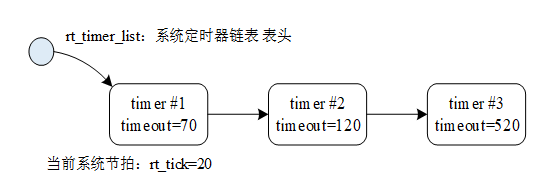

## RT-Thread

### 硬件实时内核

#### 同步与通信

信号量、互斥量、时间及、消息队列、邮箱、信号


#### libcpu/BSP

线程管理、时钟管理、中断管理内存管理


### 组件与服务

	


### 组件

#### FinSH

```shell
 \ | /
- RT -     Thread Operating System
 / | \     4.0.3 build Jan 15 2025
 2006 - 2020 Copyright by rt-thread team
msh >help
RT-Thread shell commands:
clear            - clear the terminal screen
version          - show RT-Thread version information
list_thread      - list thread
list_sem         - list semaphore in system
list_event       - list event in system
list_mutex       - list mutex in system
list_mailbox     - list mail box in system
list_msgqueue    - list message queue in system
list_mempool     - list memory pool in system
list_timer       - list timer in system
list_device      - list device in system
help             - RT-Thread shell help.
ps               - List threads in the system.
free             - Show the memory usage in the system.
reboot           - Reboot System

```


### 内核


#### 线程调度

最小的调度单位，基于优先级的全枪展多线程调度算法 支持32/8个优先级 0表示最高优先级，无线程数量限制


#### 时钟管理

时钟节拍为最小时钟单位

第一类：单次触发定时器

第二类：周期触发定时器


#### 线程间同步

使用信号量、互斥量、事件集实现线程间同步，解决竞态


#### 线程间通信

邮箱、消息队列


#### 内存管理

静态、动态

内存申请失败时挂起线程阻塞，等待时间取决于等待时间参数；内存可用时，线程被唤醒

内存管理算法：

面向大内存：SLAB

面向小内存：memheap


#### I/O设备管理

将Pin、i2c 、SPI、UART等注册为设备，通过统一API访问硬件

不同的设备可以挂接对应的事件，事件触发时通知上层应用


### RT-Thread 启动流程


> *.s->entry->{... init ... main ... }

#### 汇编

Reset_Handler->CopyDataInit->FillZerobss->SystemInit->entry(C入口)


#### C语言

entry->rtthread_startup


##### rtthread_startup

```c
int rtthread_startup(void)
{
    rt_hw_interrupt_disable();

    /* board level initialization
     * NOTE: please initialize heap inside board initialization.
     */
    rt_hw_board_init();

    /* show RT-Thread version */
    rt_show_version();

    /* timer system initialization */
    rt_system_timer_init();

    /* scheduler system initialization */
    rt_system_scheduler_init();

#ifdef RT_USING_SIGNALS
    /* signal system initialization */
    rt_system_signal_init();
#endif /* RT_USING_SIGNALS */

    /* create init_thread */
    rt_application_init();

    /* timer thread initialization */
    rt_system_timer_thread_init();

    /* idle thread initialization */
    rt_thread_idle_init();

#ifdef RT_USING_SMP
    rt_hw_spin_lock(&_cpus_lock);
#endif /* RT_USING_SMP */

    /* start scheduler */
    rt_system_scheduler_start();

    /* never reach here */
    return 0;
}
#endif /* RT_USING_USER_MAIN */
```


##### rt_application_init

```c
void rt_application_init(void)
{
    rt_thread_t tid;

#ifdef RT_USING_HEAP // 使用堆 动态分配
    tid = rt_thread_create("main", main_thread_entry, RT_NULL,
                           RT_MAIN_THREAD_STACK_SIZE, RT_MAIN_THREAD_PRIORITY, 20);
    // 线程id=线程名，入口，，栈大小，线程优先级，时钟节拍数
    RT_ASSERT(tid != RT_NULL);
#else // 静态创建
    rt_err_t result;

    tid = &main_thread;
    result = rt_thread_init(tid, "main", main_thread_entry, RT_NULL,
                            main_stack, sizeof(main_stack), RT_MAIN_THREAD_PRIORITY, 20);
    RT_ASSERT(result == RT_EOK);

    /* if not define RT_USING_HEAP, using to eliminate the warning */
    (void)result;
#endif /* RT_USING_HEAP */

    rt_thread_startup(tid);// 启动线程 执行main_thread_entry 其中调用main()(位于main.c
}
```

> 时钟节拍数决定了线程的执行时间（时间片


### 线程管理

多任务由多线程管理，线程时任务的载体

线程执行时运行环境称为上下文（变量和数据、寄存器变量内存信息


#### 线程管理特点

系统线程

用户线程：创建、调度、管理方法

两者均会从内核对象容器中分配线程对象

线程的调度器为抢占式，在就绪态线程列表中查找最高优先级进程，保证高优先级进程被优先执行；切换线程时保存上下文状态，切回时恢复现场

#### 线程工作机制

##### 线程控制块

struct rt_thread 用于管理线程的数据结构，包含优先级、线程名称、线程状态、线程与线程间的列表结构

```c
/**
 * Thread structure
 */
struct rt_thread
{
    /* rt object */
    char        name[RT_NAME_MAX];                      /**< the name of thread */
    rt_uint8_t  type;                                   /**< type of object */
    rt_uint8_t  flags;                                  /**< thread's flags */

#ifdef RT_USING_MODULE
    void       *module_id;                              /**< id of application module */
#endif /* RT_USING_MODULE */

    rt_list_t   list;                                   /**< the object list */
    rt_list_t   tlist;                                  /**< the thread list */

    /* stack point and entry */
    void       *sp;                                     /**< stack point 栈指针 */
    void       *entry;                                  /**< entry */
    void       *parameter;                              /**< parameter */
    void       *stack_addr;                             /**< stack address 栈地址指针 */
    rt_uint32_t stack_size;                             /**< stack size */

    /* error code */
    rt_err_t    error;                                  /**< error code */

    rt_uint8_t  stat;                                   /**< thread status  线程状态*/

#ifdef RT_USING_SMP   //多处理器
    rt_uint8_t  bind_cpu;                               /**< thread is bind to cpu */
    rt_uint8_t  oncpu;                                  /**< process on cpu */

    rt_uint16_t scheduler_lock_nest;                    /**< scheduler lock count */
    rt_uint16_t cpus_lock_nest;                         /**< cpus lock count */
    rt_uint16_t critical_lock_nest;                     /**< critical lock count */
#endif /*RT_USING_SMP*/

    /* priority */
    rt_uint8_t  current_priority;                       /**< current priority */
#if RT_THREAD_PRIORITY_MAX > 32
    rt_uint8_t  number;
    rt_uint8_t  high_mask;
#endif /* RT_THREAD_PRIORITY_MAX > 32 */
    rt_uint32_t number_mask;

#ifdef RT_USING_EVENT
    /* thread event */
    rt_uint32_t event_set;
    rt_uint8_t  event_info;
#endif /* RT_USING_EVENT */

#ifdef RT_USING_SIGNALS
    rt_sigset_t     sig_pending;                        /**< the pending signals */
    rt_sigset_t     sig_mask;                           /**< the mask bits of signal */

#ifndef RT_USING_SMP
    void            *sig_ret;                           /**< the return stack pointer from signal */
#endif /* RT_USING_SMP */
    rt_sighandler_t *sig_vectors;                       /**< vectors of signal handler */
    void            *si_list;                           /**< the signal infor list */
#endif /* RT_USING_SIGNALS */

    rt_ubase_t  init_tick;                              /**< thread's initialized tick */
    rt_ubase_t  remaining_tick;                         /**< remaining tick */

#ifdef RT_USING_CPU_USAGE
    rt_uint64_t  duration_tick;                          /**< cpu usage tick */
#endif /* RT_USING_CPU_USAGE */

    struct rt_timer thread_timer;                       /**< built-in thread timer */

    void (*cleanup)(struct rt_thread *tid);             /**< cleanup function when thread exit 线程退出时被idle线程回调清理现场*/

    /* light weight process if present */
#ifdef RT_USING_LWP
    void        *lwp;
#endif /* RT_USING_LWP */

    rt_ubase_t user_data;                             /**< private user data beyond this thread */
};
typedef struct rt_thread *rt_thread_t;
```


#### 线程属性

##### 线程栈

RT-Thread 线程具有独立的栈，当进行线程切换时，会将当前线程的上下文存在栈中，当线程要恢复运行时，再从栈中读取上下文信息，进行恢复。


##### 线程状态

| 状态     | 描述                                                         |
| -------- | ------------------------------------------------------------ |
| 初始状态 | 当线程刚开始创建还没开始运行时就处于初始状态；在初始状态下，线程不参与调度。此状态在 RT-Thread 中的宏定义为 **RT_THREAD_INIT** |
| 就绪状态 | 在就绪状态下，线程按照优先级排队，等待被执行；一旦当前线程运行完毕让出处理器，操作系统会马上寻找最高优先级的就绪态线程运行。此状态在 RT-Thread 中的宏定义为 **RT_THREAD_READY** |
| 运行状态 | 线程当前正在运行。在单核系统中，只有 rt_thread_self() 函数返回的线程处于运行状态；在多核系统中，可能就不止这一个线程处于运行状态。此状态在 RT-Thread 中的宏定义为 **RT_THREAD_RUNNING** |
| 挂起状态 | 也称阻塞态。它可能因为**资源不可用**而挂起等待，或**线程主动延时一段时间**而挂起。在挂起状态下，线程不参与调度。此状态在 RT-Thread 中的宏定义为 **RT_THREAD_SUSPEND** |
| 关闭状态 | 当线程运行结束时将处于关闭状态。关闭状态的线程不参与线程的调度。此状态在 RT-Thread 中的宏定义为 **RT_THREAD_CLOSE** |


##### 线程优先级

0-255，0为最高，一般为32个优先级，最低优先级被idle使用

当更高优先级的线程就绪，线程立即被换出，高优先级抢占处理器运行


##### 时间片

时间片仅在优先级相同的就绪态线程有效，有效时遵循时间片轮询算法


##### 线程状态切换


#### 线程操作

创建/初始化、启动、运行、删除/脱离


##### 创建与删除线程

创建

```c
rt_thread_t rt_thread_create(const char* name,
                            void (*entry)(void* parameter),
                            void* parameter,
                            rt_uint32_t stack_size,
                            rt_uint8_t priority,
                            rt_uint32_t tick);

```

| **参数**   | **描述**                                                     |
| ---------- | ------------------------------------------------------------ |
| name       | 线程的名称；线程名称的最大长度由 rtconfig.h 中的宏 RT_NAME_MAX  (8)指定，多余部分会被自动截掉 |
| entry      | 线程入口函数                                                 |
| parameter  | 线程入口函数参数                                             |
| stack_size | 线程栈大小，单位是字节                                       |
| priority   | 线程的优先级。优先级范围根据系统配置情况（rtconfig.h 中的 RT_THREAD_PRIORITY_MAX 宏定义）数值越小优先级越高，0 代表最高优先级 |
| tick       | 线程的时间片大小。时间片（tick）的单位是操作系统的时钟节拍。**当系统中存在相同优先级线程时**，这个参数指定线程一次调度能够运行的最大时间长度。这个时间片运行结束时，调度器自动选择下一个就绪态的同优先级线程进行运行 |
| **返回**   | ——                                                           |
| thread     | 线程创建成功，返回线程句柄 rt_thread_t线程数据块             |
| RT_NULL    | 线程创建失败                                                 |

删除

```c
rt_err_t rt_thread_delete(rt_thread_t thread);
```

| **参数**  | **描述**         |
| --------- | ---------------- |
| thread    | 要删除的线程句柄 |
| **返回**  | ——               |
| RT_EOK    | 删除线程成功     |
| -RT_ERROR | 删除线程失败     |


##### 初始化与脱离线程

> 静态 区别为需要设置栈起始地址

初始化

```c
rt_err_t rt_thread_init(struct rt_thread* thread,
                        const char* name,
                        void (*entry)(void* parameter), void* parameter,
                        void* stack_start, rt_uint32_t stack_size,
                        rt_uint8_t priority, rt_uint32_t tick);
```

| **参数**    | **描述**                                                     |
| ----------- | ------------------------------------------------------------ |
| thread      | 线程句柄。线程句柄由用户提供出来，并指向对应的线程控制块内存地址 |
| name        | 线程的名称；线程名称的最大长度由 rtconfig.h 中定义的 RT_NAME_MAX 宏指定，多余部分会被自动截掉 |
| entry       | 线程入口函数                                                 |
| parameter   | 线程入口函数参数                                             |
| stack_start | 线程栈起始地址                                               |
| stack_size  | 线程栈大小，单位是字节。在大多数系统中需要做栈空间地址对齐（例如 ARM 体系结构中需要向 4 字节地址对齐） |
| priority    | 线程的优先级。优先级范围根据系统配置情况（rtconfig.h 中的 RT_THREAD_PRIORITY_MAX 宏定义），如果支持的是 256 级优先级，那么范围是从 0 ～ 255，数值越小优先级越高，0 代表最高优先级 |
| tick        | 线程的时间片大小。时间片（tick）的单位是操作系统的时钟节拍。当系统中存在相同优先级线程时，这个参数指定线程一次调度能够运行的最大时间长度。这个时间片运行结束时，调度器自动选择下一个就绪态的同优先级线程进行运行 |
| **返回**    | ——                                                           |
| RT_EOK      | 线程创建成功                                                 |
| -RT_ERROR   | 线程创建失败                                                 |

脱离

```c
rt_err_t rt_thread_detach (rt_thread_t thread);
```

| **参数**  | **描述**                                                   |
| --------- | ---------------------------------------------------------- |
| thread    | 线程句柄，它应该是由 rt_thread_init 进行初始化的线程句柄。 |
| **返回**  | ——                                                         |
| RT_EOK    | 线程脱离成功                                               |
| -RT_ERROR | 线程脱离失败                                               |


##### 启动线程

```c
rt_err_t rt_thread_startup(rt_thread_t thread);
```

| **参数**  | **描述**     |
| --------- | ------------ |
| thread    | 线程句柄     |
| **返回**  | ——           |
| RT_EOK    | 线程启动成功 |
| -RT_ERROR | 线程启动失败 |


##### 获取当前线程

用于应对一个函数被多个线程执行，但是执行不一样操作的情况

```c
rt_thread_t rt_thread_self(void);
```


##### 线程主动让出

```c
rt_err_t rt_thread_yield(void);
```


##### 线程睡眠

```c
rt_err_t rt_thread_sleep(rt_tick_t tick);
rt_err_t rt_thread_delay(rt_tick_t tick);
rt_err_t rt_thread_mdelay(rt_int32_t ms);
```


##### 线程挂起与恢复

```c
rt_err_t rt_thread_suspend (rt_thread_t thread);
```

```c
rt_err_t rt_thread_resume (rt_thread_t thread);
```


##### 控制线程

修改优先级、启动、关闭、绑定运行核心

```c
rt_err_t rt_thread_control(rt_thread_t thread, rt_uint8_t cmd, void* arg);
```


##### 空闲Hook设置与删除

空闲构造会在系统执行空闲线程时调用

> 在使用此函数时，线程必须一直处于就绪状态/运行状态，不可处于其他状态（1）的函数不可存在，即不可存在使线程挂起的函数

```c
rt_err_t rt_thread_idle_sethook(void (*hook)(void));
rt_err_t rt_thread_idle_delhook(void (*hook)(void));
```


##### 调度器Hook

线程切换时将被调用，用于调试程序的运行逻辑、线程的调度关系

```c
void rt_scheduler_sethook(void (*hook)(struct rt_thread* from, struct rt_thread* to));
```


#### 注意

线程不应完全死循环，应当有就绪态操作（例如添加延时）或者主动挂起让出处理器


#### 示例

##### thread&hook

```c
#include <rtthread.h>
#define DBG_TAG "thread"
#define DBG_LVL DBG_LOG
#include <rtdbg.h>
void test_thread_entry(void *parameter)
{
    uint32_t count=1;
    while(count++){
        LOG_D("test_thread_entry count: %d \n",count);
        rt_thread_mdelay(1000);
    }
}
static void scheduler_hook(struct rt_thread *from, struct rt_thread *to){
    LOG_D("from:%s--->to:%s\n",from->name,to->name);
}
int test_thread(void)
{
    static rt_thread_t TaskHandle=RT_NULL;
    rt_scheduler_sethook(scheduler_hook);
    TaskHandle = rt_thread_create("thread1",
                                       test_thread_entry, RT_NULL,
                                       512, 10, 5);
    if (TaskHandle != RT_NULL)
    {
        rt_thread_startup(TaskHandle);
        return RT_EOK;
    }
    else
    {
        return -1;
    }
}
INIT_APP_EXPORT(test_thread);

```


### 时钟管理

RT-Thread需要时钟管理任务


#### 时钟节拍

时钟节拍长度**RT_TICK_PER_SECOND** 定义，为1/RT_TICK_PER_SECOND 秒


##### 时钟节拍实现方式

原理为使用系统滴答定时器中断

```c
void SysTick_Handler(void)
{
    /* 进入中断 */
    rt_interrupt_enter();
    ……
    rt_tick_increase();
    /* 退出中断 */
    rt_interrupt_leave();
}
```


##### 获取时钟节拍

用于确认任务执行耗时

```c
rt_tick_t rt_tick_get(void);
```


#### 定时器

经过指定时间处理触发事件，实现形式分硬件与软件

硬件定时器：芯片本身提供的定时功能，到达设定值触发中断，精度高

软件定时器：系统给出的结构，构建于硬件定时器之上，但是无数量限制

定时的时间必须是时钟节拍的整数倍


##### 定时器触发机制

单次触发：启动后一定时间后触发一次

周期触发：启动后周期性触发事件，直至手动停止


##### 定时器模式

HARD_TIMER：即硬件定时器，中断上下文；执行时间尽量短，不应导致上下文挂起/等待

SOFT_TIMER：软件定时器，线程上下文；创建timer线程，超时函数在timer的线程的上下文环境执行


##### 定时器管理方式

初始化定时管理系统

```c
void rt_system_timer_init(void); //初始化硬件定时器列表
```

初始化系统定时器线程

```c
void rt_system_timer_thread_init(void);
// 初始化软件定时器列表
// 创建线程
```


##### 定时器工作机制

rt_tick：经过一个tick时++

rt_timer_list：创建并激活的定时器按照超时时间插入到这个链表中



当tick==定时器tick，触发定时器超时回调


###### 定时器控制块

```c
struct rt_timer
{
    struct rt_object parent;
    rt_list_t row[RT_TIMER_SKIP_LIST_LEVEL];  /* 定时器链表节点 */

    void (*timeout_func)(void *parameter);    /* 定时器超时调用的函数 */
    void      *parameter;                         /* 超时函数的参数 */
    rt_tick_t init_tick;                         /* 定时器初始超时节拍数 */
    rt_tick_t timeout_tick;                     /* 定时器实际超时时的节拍数 */
};
typedef struct rt_timer *rt_timer_t;
```


##### 定时器接口

###### 创建与删除定时器

创建

```c
rt_timer_t rt_timer_create(const char* name,
                           void (*timeout)(void* parameter),
                           void* parameter,
                           rt_tick_t time,
                           rt_uint8_t flag);
```

```c
#define RT_TIMER_FLAG_ONE_SHOT      0x0     /* 单次定时     */
#define RT_TIMER_FLAG_PERIODIC      0x2     /* 周期定时     */

#define RT_TIMER_FLAG_HARD_TIMER    0x0     /* 硬件定时器   */
#define RT_TIMER_FLAG_SOFT_TIMER    0x4     /* 软件定时器   */
```

| **参数**                        | **描述**                                                     |
| ------------------------------- | ------------------------------------------------------------ |
| name                            | 定时器的名称                                                 |
| void (timeout) (void parameter) | 定时器超时函数指针（当定时器超时时，系统会调用这个函数）     |
| parameter                       | 定时器超时函数的入口参数（当定时器超时时，调用超时回调函数会把这个参数做为入口参数传递给超时函数） |
| time                            | 定时器的超时时间，单位是时钟节拍                             |
| flag                            | 定时器创建时的参数，支持的值包括单次定时、周期定时、硬件定时器、软件定时器等（可以用 “或” 关系取多个值） |
| **返回**                        | ——                                                           |
| RT_NULL                         | 创建失败（通常会由于系统内存不够用而返回 RT_NULL）           |
| 定时器的句柄                    | 定时器创建成功                                               |

删除

```c
rt_err_t rt_timer_delete(rt_timer_t timer);
```

| **参数** | **描述**                                                     |
| -------- | ------------------------------------------------------------ |
| timer    | 定时器句柄，指向要删除的定时器                               |
| **返回** | ——                                                           |
| RT_EOK   | 删除成功（如果参数 timer 句柄是一个 RT_NULL，将会导致一个 ASSERT 断言） |

###### 初始化和脱离定时器

初始化

```c
void rt_timer_init(rt_timer_t timer,
                   const char* name,
                   void (*timeout)(void* parameter),
                   void* parameter,
                   rt_tick_t time, rt_uint8_t flag);
```

| **参数**                        | **描述**                                                     |
| ------------------------------- | ------------------------------------------------------------ |
| timer                           | 定时器句柄，指向要初始化的定时器控制块                       |
| name                            | 定时器的名称                                                 |
| void (timeout) (void parameter) | 定时器超时函数指针（当定时器超时时，系统会调用这个函数）     |
| parameter                       | 定时器超时函数的入口参数（当定时器超时时，调用超时回调函数会把这个参数做为入口参数传递给超时函数） |
| time                            | 定时器的超时时间，单位是时钟节拍                             |
| flag                            | 定时器创建时的参数，支持的值包括单次定时、周期定时、硬件定时器、软件定时器（可以用 “或” 关系取多个值），详见创建定时器小节 |

脱离

```c
rt_err_t rt_timer_detach(rt_timer_t timer);
```

| **参数** | **描述**                             |
| -------- | ------------------------------------ |
| timer    | 定时器句柄，指向要脱离的定时器控制块 |
| **返回** | ——                                   |
| RT_EOK   | 脱离成功                             |


###### 启动和停止定时器

启动

```c
rt_err_t rt_timer_start(rt_timer_t timer);
```

| **参数** | **描述**                             |
| -------- | ------------------------------------ |
| timer    | 定时器句柄，指向要启动的定时器控制块 |
| **返回** | ——                                   |
| RT_EOK   | 启动成功                             |

停止

```c
rt_err_t rt_timer_stop(rt_timer_t timer);
```

| **参数**   | **描述**                             |
| ---------- | ------------------------------------ |
| timer      | 定时器句柄，指向要停止的定时器控制块 |
| **返回**   | ——                                   |
| RT_EOK     | 成功停止定时器                       |
| - RT_ERROR | timer 已经处于停止状态               |

###### 控制定时器

```c
rt_err_t rt_timer_control(rt_timer_t timer, rt_uint8_t cmd, void* arg);
```

```c
#define RT_TIMER_CTRL_SET_TIME      0x0     /* 设置定时器超时时间       */
#define RT_TIMER_CTRL_GET_TIME      0x1     /* 获得定时器超时时间       */
#define RT_TIMER_CTRL_SET_ONESHOT   0x2     /* 设置定时器为单次定时器   */
#define RT_TIMER_CTRL_SET_PERIODIC  0x3     /* 设置定时器为周期型定时器 */
```

| **参数** | **描述**                                                     |
| -------- | ------------------------------------------------------------ |
| timer    | 定时器句柄，指向要控制的定时器控制块                         |
| cmd      | 用于控制定时器的命令，当前支持四个命令，分别是设置定时时间，查看定时时间，设置单次触发，设置周期触发 |
| arg      | 与 cmd 相对应的控制命令参数 比如，cmd 为设定超时时间时，就可以将超时时间参数通过 arg 进行设定 |
| **返回** | ——                                                           |
| RT_EOK   | 成功                                                         |


###### 高精度延时

低于一个系统节拍数的延时，即小于1ms的延时[1-99us]

```c
void rt_hw_us_delay(rt_uint32_t us)
```


#### 示例

##### tick

```c
#include <rtthread.h>
#define DBG_TAG "tick"
#define DBG_LVL DBG_LOG
#include <rtdbg.h>
void test_tick_entry(void *parameter)
{
    rt_tick_t tick_s=0;
    while(1){
        tick_s=rt_tick_get();
        LOG_D("tick is: %u \n",tick_s);
        rt_thread_mdelay(500);
    }
}
static void scheduler_hook(struct rt_thread *from, struct rt_thread *to){
    LOG_D("from:%s--->to:%s",from->name,to->name);
}
int tick_test(void)
{
    static rt_thread_t TaskHandle=RT_NULL;
    rt_scheduler_sethook(scheduler_hook);
    TaskHandle = rt_thread_create("tick1",
                                       test_tick_entry, RT_NULL,
                                       512, 10, 5);
    if (TaskHandle != RT_NULL)
    {
        rt_thread_startup(TaskHandle);
        return RT_EOK;
    }
    else
    {
        return -1;
    }
}
INIT_APP_EXPORT(tick_test);

```

##### soft_timer

```c
#include <rtthread.h>
#define DBG_TAG "soft_timer"
#define DBG_LVL DBG_LOG
#include <rtdbg.h>
static void s_tm_callback(void *parameter)
{
    rt_tick_t tick_s=0;
    tick_s=rt_tick_get();
    LOG_D("s_timer1 tick is: %u \n",tick_s);
}
int s_timer_test(void)
{
    static rt_timer_t tm;
    tm=rt_timer_create("s_timer1",
                    s_tm_callback, NULL,
                    500, RT_TIMER_FLAG_PERIODIC|RT_TIMER_FLAG_SOFT_TIMER);
    if(tm!=RT_NULL){
        LOG_D("create s_time1 successes");
        rt_timer_start(tm);
        return RT_EOK;
    }else{
        LOG_E("create s_time1 failed");
        return -RT_ERROR;
    }
}
INIT_APP_EXPORT(s_timer_test);

```

##### hard_timer

```c
#include <rtthread.h>
#define DBG_TAG "hard_timer"
#define DBG_LVL DBG_LOG
#include <rtdbg.h>
static void h_tm_callback(void *parameter)
{
    rt_tick_t tick_s=0;
    tick_s=rt_tick_get();
    LOG_D("h_timer1 tick is: %u \n",tick_s);
}
int h_timer_test(void)
{
    static rt_timer_t tm;
    tm=rt_timer_create("h_timer1",
                    h_tm_callback, NULL,
                    500, RT_TIMER_FLAG_PERIODIC|RT_TIMER_FLAG_HARD_TIMER);
    if(tm!=RT_NULL){
        LOG_D("create h_time1 successes");
        rt_timer_start(tm);
        return RT_EOK;
    }else{
        LOG_E("create h_time1 failed");
        return -RT_ERROR;
    }
}
INIT_APP_EXPORT(h_timer_test);

```


### 线程间同步

多个执行单元（线程、中断、处理器核心）同时执行临界区、操作临界资源会导致竞态，以下同步互斥机制解决竞态问题

同步：假设有两个线程t1、t2,指定仅t1操作完毕后t2才可以操作

互斥：没有顺序，但是仅一个线程操作完毕后另一个线程才可以操作


#### 信号量

##### 信号量工作机制

线程通过获取与释放信号量实现同步或互斥

每个信号量对象都有一个信号量值与线程等待队列，当信号量值大于0，则有大于0个的资源，为0时，申请该信号量的线程被挂起在该信号量的等待队列，直到信号量大于0唤醒线程变为就绪态


###### 信号量控制块

```c
struct rt_semaphore
{
   struct rt_ipc_object parent;  /* 继承自 ipc_object 类 */
   rt_uint16_t value;            /* 信号量的值 */
};
/* rt_sem_t 是指向 semaphore 结构体的指针类型 */
typedef struct rt_semaphore* rt_sem_t;
```

rt_semaphore 对象从 rt_ipc_object 中派生，由 IPC 容器所管理，信号量的最大值是 65535


##### 信号量的使用与管理


创建 / 初始化信号量、获取信号量、释放信号量、删除 / 脱离信号量


###### 创建和删除信号量

创建

```c
 rt_sem_t rt_sem_create(const char *name,
                        rt_uint32_t value,
                        rt_uint8_t flag);
```

```c
#define RT_IPC_FLAG_FIFO                0x00            /*先来后到 与优先级无关 变更为非实时调度*/
#define RT_IPC_FLAG_PRIO                0x01            /**与优先级有关 */
```

| **参数**           | **描述**                                                     |
| ------------------ | ------------------------------------------------------------ |
| name               | 信号量名称                                                   |
| value              | 信号量初始值                                                 |
| flag               | 信号量标志，它可以取如下数值： RT_IPC_FLAG_FIFO 或 RT_IPC_FLAG_PRIO |
| **返回**           | ——                                                           |
| RT_NULL            | 创建失败                                                     |
| 信号量的控制块指针 | 创建成功                                                     |

删除

```c
rt_err_t rt_sem_delete(rt_sem_t sem);
```

| **参数** | **描述**                         |
| -------- | -------------------------------- |
| sem      | rt_sem_create() 创建的信号量对象 |
| **返回** | ——                               |
| RT_EOK   | 删除成功s                        |

> 若有线程等待该信号量，删除时则先唤醒线程并释放该信号量的内存资源


###### 初始化和脱离信号量

初始化

```c
rt_err_t rt_sem_init(rt_sem_t       sem,
                    const char     *name,
                    rt_uint32_t    value,
                    rt_uint8_t     flag)
```

| **参数** | **描述**                                                     |
| -------- | ------------------------------------------------------------ |
| sem      | 信号量对象的句柄                                             |
| name     | 信号量名称                                                   |
| value    | 信号量初始值                                                 |
| flag     | 信号量标志，它可以取如下数值： RT_IPC_FLAG_FIFO 或 RT_IPC_FLAG_PRIO |
| **返回** | ——                                                           |
| RT_EOK   | 初始化成功                                                   |

脱离

```c
rt_err_t rt_sem_detach(rt_sem_t sem);
```

| **参数** | **描述**         |
| -------- | ---------------- |
| sem      | 信号量对象的句柄 |
| **返回** | ——               |
| RT_EOK   | 脱离成功         |


###### 获取信号量

当信号量值大于0，则获取该线程获得信号量，并将其值减1

如值等于0，则根据设置的时间直接返回/等待一段时间/一直等待挂起

```c
rt_err_t rt_sem_take (rt_sem_t sem, rt_int32_t time);
```

```c
#define RT_WAITING_FOREVER              -1              /**< 一直等待 */
#define RT_WAITING_NO                   0               /**< 不等待 */
```

| **参数**     | **描述**                                          |
| ------------ | ------------------------------------------------- |
| sem          | 信号量对象的句柄                                  |
| time         | 指定的等待时间，单位是操作系统时钟节拍（OS Tick） |
| **返回**     | ——                                                |
| RT_EOK       | 成功获得信号量                                    |
| -RT_ETIMEOUT | 超时依然未获得信号量                              |
| -RT_ERROR    | 其他错误                                          |


###### 无等待获取信号量

是`rt_sem_take(sem, RT_WAITING_NO)`的封装

```c
rt_err_t rt_sem_trytake(rt_sem_t sem);
```

| **参数**     | **描述**         |
| ------------ | ---------------- |
| sem          | 信号量对象的句柄 |
| **返回**     | ——               |
| RT_EOK       | 成功获得信号量   |
| -RT_ETIMEOUT | 获取失败         |


###### 释放信号量

该操作会唤醒因无法获取信号量而挂起在该信号量的线程

唤醒第一个线程，如果无线程可唤醒则值加1

```c
rt_err_t rt_sem_release(rt_sem_t sem);
```

| **参数** | **描述**         |
| -------- | ---------------- |
| sem      | 信号量对象的句柄 |
| **返回** | ——               |
| RT_EOK   | 成功释放信号量   |


#### 互斥量

排他性，未强调顺序

类似于二值信号量，信号量可由不同线程释放，**互斥量仅可由同一个线程释放**


##### 互斥量工作机制

互斥量有开锁与闭锁两种状态，

当有线程获取他时，互斥量处于闭锁状态，

当线程释放，则失去所有权

互斥量解决了使用信号量可能会导致的优先级翻转的问题


###### 互斥量数据块

```c
struct rt_mutex
    {
        struct rt_ipc_object parent;                /* 继承自 ipc_object 类 */

        rt_uint16_t          value;                   /* 互斥量的值 */
        rt_uint8_t           original_priority;     /* 持有线程的原始优先级 */
        rt_uint8_t           hold;                     /* 持有线程的持有次数   */
        struct rt_thread    *owner;                 /* 当前拥有互斥量的线程 */
    };
    /* rt_mutext_t 为指向互斥量结构体的指针类型  */
    typedef struct rt_mutex* rt_mutex_t;
```

rt_mutex 对象从 rt_ipc_object 中派生，由 IPC 容器所管理。

##### 互斥量的使用与管理


创建 / 初始化互斥量、获取互斥量、释放互斥量、删除 / 脱离互斥量


###### 创建和删除互斥量

创建

```c
rt_mutex_t rt_mutex_create (const char* name, rt_uint8_t flag);
```

```c
#define RT_IPC_FLAG_FIFO                0x00            /*先来后到 与优先级无关 变更为非实时调度*/
#define RT_IPC_FLAG_PRIO                0x01            /**与优先级有关 */
```

| **参数**   | **描述**                                                     |
| ---------- | ------------------------------------------------------------ |
| name       | 互斥量的名称                                                 |
| flag       | 该标志已经作废，无论用户选择 RT_IPC_FLAG_PRIO 还是 RT_IPC_FLAG_FIFO，内核均按照 RT_IPC_FLAG_PRIO 处理 |
| **返回**   | ——                                                           |
| 互斥量句柄 | 创建成功                                                     |
| RT_NULL    | 创建失败                                                     |

> 但是，无论如何设置flag内核均按照`RT_IPC_FLAG_PRIO`处理

删除

```c
rt_err_t rt_mutex_delete (rt_mutex_t mutex);
```

| **参数** | **描述**         |
| -------- | ---------------- |
| mutex    | 互斥量对象的句柄 |
| **返回** | ——               |
| RT_EOK   | 删除成功         |

> 当删除一个互斥量时，所有等待此互斥量的线程都将被唤醒，然后将该互斥量从内核对象管理器链表中删除并释放互斥量占用的内存空间


###### 初始化和脱离互斥量

初始化

```c
rt_err_t rt_mutex_init (rt_mutex_t mutex, const char* name, rt_uint8_t flag);
```

| **参数** | **描述**                                                     |
| -------- | ------------------------------------------------------------ |
| mutex    | 互斥量对象的**句柄**，它由用户提供，并指向互斥量对象的内存块 |
| name     | 互斥量的名称                                                 |
| flag     | 该标志已经作废，无论用户选择 RT_IPC_FLAG_PRIO 还是 RT_IPC_FLAG_FIFO，内核均按照 RT_IPC_FLAG_PRIO 处理 |
| **返回** | ——                                                           |

脱离

```c
rt_err_t rt_mutex_detach (rt_mutex_t mutex);
```

| **参数** | **描述**         |
| -------- | ---------------- |
| mutex    | 互斥量对象的句柄 |
| **返回** | ——               |
| RT_EOK   | 成功             |


###### 获取互斥量

```c
rt_err_t rt_mutex_take (rt_mutex_t mutex, rt_int32_t time);
```

```c
x#define RT_WAITING_FOREVER              -1              /**< 一直等待 */#define RT_WAITING_NO                   0               /**< 不等待 */
```

成功获取时，该互斥量持有计数加1

如果互斥量被其他线程占有则根据设置的时间直接返回/等待一段时间/一直等待挂起

| **参数**     | **描述**         |
| ------------ | ---------------- |
| mutex        | 互斥量对象的句柄 |
| time         | 指定等待的时间   |
| **返回**     | ——               |
| RT_EOK       | 成功获得互斥量   |
| -RT_ETIMEOUT | 超时             |
| -RT_ERROR    | 获取失败         |


###### 无等待获取互斥量

是`rt_mutex_take(mutex, RT_WAITING_NO)`的封装

```c
rt_err_t rt_mutex_trytake(rt_mutex_t mutex);
```

| **参数**     | **描述**         |
| ------------ | ---------------- |
| mutex        | 互斥量对象的句柄 |
| **返回**     | ——               |
| RT_EOK       | 成功获得互斥量   |
| -RT_ETIMEOUT | 获取失败         |


###### 释放互斥量

```c
rt_err_t rt_mutex_release(rt_mutex_t mutex);
```

| **参数** | **描述**         |
| -------- | ---------------- |
| mutex    | 互斥量对象的句柄 |
| **返回** | ——               |
| RT_EOK   | 成功             |


#### 事件集


#### 示例

##### sem

```c
#include <rtthread.h>
#define DBG_TAG "sem"
#define DBG_LVL DBG_LOG
#include <rtdbg.h>
rt_sem_t sem1 = RT_NULL;
int sem_test(void)
{
    sem1=rt_sem_create("sem1", 1, RT_IPC_FLAG_FIFO);
    if(sem1!=RT_NULL){
        LOG_D("create sem1 successes");
        return RT_EOK;
    }else{
        LOG_E("create sem1 failed");
        return -RT_ERROR;
    }
}
INIT_APP_EXPORT(sem_test);

```

##### sem_syn

```c
#include <rtthread.h>
#define DBG_TAG "sem_syn"
#define DBG_LVL DBG_LOG
#include <rtdbg.h>
rt_sem_t sem_syn1, sem_syn2;
rt_thread_t th1,th2;
int flags =0;

void th1_entry(void *parameter){
    while(1){
        rt_thread_mdelay(500);
        rt_sem_take(sem_syn1,RT_WAITING_FOREVER);
        flags+=5;
        if(flags>=100){
           flags=0;
        }
        LOG_D("th1_entry [%d]",flags);
        rt_sem_release(sem_syn2);
    }
}

void th2_entry(void *parameter){
    while(1){
        rt_sem_take(sem_syn2,RT_WAITING_FOREVER);
        if(flags>0){
           flags--;
        }
        LOG_D("th2_entry [%d]",flags);
        rt_thread_mdelay(100);
        rt_sem_release(sem_syn1);
    }
}

int sem_syn_test(void)
{
    sem_syn1=rt_sem_create("sem_syn1", 1, RT_IPC_FLAG_FIFO);
    if(sem_syn1!=RT_NULL){
        LOG_D("create sem_syn1 successes");
    }else{
        LOG_E("create sem_syn1 failed");
        return -RT_ERROR;
    }

    sem_syn2=rt_sem_create("sem_syn2", 0, RT_IPC_FLAG_FIFO);
    if(sem_syn2!=RT_NULL){
        LOG_D("create sem_syn2 successes");
    }else{
        LOG_E("create sem_syn2 failed");
        return -RT_ERROR;
    }

    th1=rt_thread_create("th1", th1_entry, NULL, 512, 20, 5);
    if(th1!=RT_NULL){
        LOG_D("create th1 successes");
        rt_thread_startup(th1);
    }else{
        LOG_E("create th1 failed");
        return -RT_ERROR;
    }
    th2=rt_thread_create("th2", th2_entry, NULL, 512, 20, 5);
    if(th2!=RT_NULL){
        LOG_D("create th2 successes");
        rt_thread_startup(th2);
    }else{
        LOG_E("create th2 failed");
        return -RT_ERROR;
    }
    return RT_EOK;
}
INIT_APP_EXPORT(sem_syn_test);

```

##### mutex

```c
#include <rtthread.h>
#define DBG_TAG "sem_mut"
#define DBG_LVL DBG_LOG
#include <rtdbg.h>
rt_mutex_t mutex1;
rt_thread_t th1,th2;
int flag1 =0,flag2 =0;
void th1_entry(void *parameter){
    while(1){
        rt_mutex_take(mutex1,RT_WAITING_FOREVER);
        flag1++;
        rt_thread_mdelay(500);
        flag2++;
        rt_mutex_release(mutex1);
    }
}

void th2_entry(void *parameter){
    while(1){
        rt_mutex_take(mutex1,RT_WAITING_FOREVER);
        flag1++;
        flag2++;
        if(flag1==flag2){
            LOG_D("flag1==flag2:%d\n",flag1);//无互斥锁，此处永远不触发
        }else{
            LOG_D("flag1:%d,flag2:%d\n",flag1,flag2);
        }
        rt_mutex_release(mutex1);
    }
}

int sem_mut_test(void)
{
    mutex1=rt_mutex_create("mutex1", RT_IPC_FLAG_PRIO);
    if(mutex1!=RT_NULL){
        LOG_D("create mutex1 successes");
    }else{
        LOG_E("create mutex1 failed");
        return -RT_ERROR;
    }

    th1=rt_thread_create("th1", th1_entry, NULL, 512, 20, 5);
    if(th1!=RT_NULL){
        LOG_D("create th1 successes");
        rt_thread_startup(th1);
    }else{
        LOG_E("create th1 failed");
        return -RT_ERROR;
    }
    th2=rt_thread_create("th2", th2_entry, NULL, 512, 20, 5);
    if(th2!=RT_NULL){
        LOG_D("create th2 successes");
        rt_thread_startup(th2);
    }else{
        LOG_E("create th2 failed");
        return -RT_ERROR;
    }
    return RT_EOK;
}
INIT_APP_EXPORT(sem_mut_test);

```

