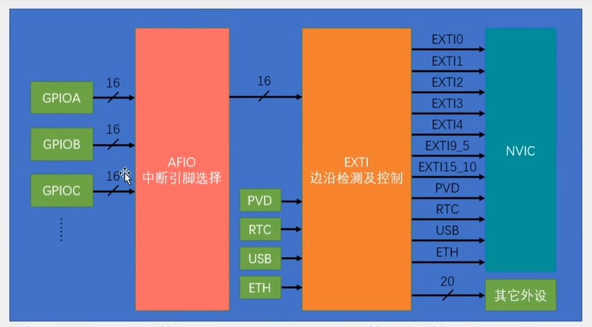

> 大量参考[江协科技](https://www.bilibili.com/video/BV1th411z7sn?p=12&vd_source=a72069186a610509925b0932bb49f8cc)视频，十分感谢给出的教程

## 什么是EXTI

EXTI可以检测GPIO的电平，当电平变化时，EXIT向NVIC发出中断申请，由NVIC裁决中断的执行情况，之后执行EXIT对应的中断程序

## 触发方式

上升沿、下降沿、双边沿、软件触发

## 支持的类型

支持所有的GPIO，但是相同的Pin不可同时触发中断例如PA0和PB0，这两个是冲突的

## 通道数量

16个GPIO_Pin，PVD输出、RTC闹钟、USB唤醒、以太网唤醒

## 触发响应方式

中断响应/事件响应

### 基本结构



AFIO类似于数据选择器，会在GPIOXx中选择选择其一

外部中断9_5 15_10,只会触发一个中断函数，但是通过`GPIO_ReadInputDataBit`可以判断中断触发线，即可得知中断触发自何处

## 如何配置

### 总览：

```c
RCC_APB2PeriphClockCmd(RCC_APB2Periph_GPIOB, ENABLE);
RCC_APB2PeriphClockCmd(RCC_APB2Periph_AFIO, ENABLE);

GPIO_InitTypeDef GPIO_InitStructure;
GPIO_InitStructure.GPIO_Mode = GPIO_Mode_IPU;
GPIO_InitStructure.GPIO_Pin = GPIO_Pin_14;
GPIO_InitStructure.GPIO_Speed = GPIO_Speed_50MHz;
GPIO_Init(GPIOB, &GPIO_InitStructure);

GPIO_EXTILineConfig(GPIO_PortSourceGPIOB, GPIO_PinSource14);

EXTI_InitTypeDef EXTI_InitStructure;
EXTI_InitStructure.EXTI_Line = EXTI_Line14;
EXTI_InitStructure.EXTI_LineCmd = ENABLE;
EXTI_InitStructure.EXTI_Mode = EXTI_Mode_Interrupt;
EXTI_InitStructure.EXTI_Trigger = EXTI_Trigger_Falling;
EXTI_Init(&EXTI_InitStructure);

NVIC_PriorityGroupConfig(NVIC_PriorityGroup_2);

NVIC_InitTypeDef NVIC_InitStructure;
NVIC_InitStructure.NVIC_IRQChannel = EXTI15_10_IRQn;
NVIC_InitStructure.NVIC_IRQChannelCmd = ENABLE;
NVIC_InitStructure.NVIC_IRQChannelPreemptionPriority = 1;
NVIC_InitStructure.NVIC_IRQChannelSubPriority = 1;
NVIC_Init(&NVIC_InitStructure);
```

### 配置时钟

```c
RCC_APB2PeriphClockCmd(RCC_APB2Periph_GPIOB, ENABLE);//启用外设时钟
RCC_APB2PeriphClockCmd(RCC_APB2Periph_AFIO, ENABLE);//启用AFIO的时钟

//EXTI默认开启无需配置也无法配置
//NVIC也是，内核的外设，无法涉及
```

### 配置GPIO

```c
GPIO_InitTypeDef GPIO_InitStructure;
GPIO_InitStructure.GPIO_Mode = GPIO_Mode_IPU;//8.1.11，上拉输入
GPIO_InitStructure.GPIO_Pin = GPIO_Pin_14;//Pin14
GPIO_InitStructure.GPIO_Speed = GPIO_Speed_50MHz;//50Mhz
GPIO_Init(GPIOB, &GPIO_InitStructure);
```

设置输入模式

1、定义结构体 GPIO_InitTypeDef

```c
GPIO_InitTypeDef GPIO_InitStructure;
GPIO_InitStructure.GPIO_Mode = GPIO_Mode_IPU;//8.1.11，上拉输入
GPIO_InitStructure.GPIO_Pin = GPIO_Pin_14;//Pin14
GPIO_InitStructure.GPIO_Speed = GPIO_Speed_50MHz;//50Mhz
```

2、使用定义的结构体初始化

```c
GPIO_Init(GPIOB, &GPIO_InitStructure);
```

### 配置AFIO

选择连接到EXTI的GPIO

#### 连接GPIO

```c
GPIO_EXTILineConfig(GPIO_PortSourceGPIOB, GPIO_PinSource14);
```

配置AFIO选择器

```c
/**
  * @brief  Selects the GPIO pin used as EXTI Line.
  * @param  GPIO_PortSource: selects the GPIO port to be used as source for EXTI lines.
  *   This parameter can be GPIO_PortSourceGPIOx where x can be (A..G).
  * @param  GPIO_PinSource: specifies the EXTI line to be configured.
  *   This parameter can be GPIO_PinSourcex where x can be (0..15).
  * @retval None
  */
void GPIO_EXTILineConfig(uint8_t GPIO_PortSource, uint8_t GPIO_PinSource)
```

参数

1、中断源 例如PB14 为**GPIO_PortSourceGPIOB**

2、指定配置的外部中断线  例如PB14 为**GPIO_PinSource14**

#### 相关函数：

```c
void GPIO_AFIODeInit(void);//复位AFIO外设
void GPIO_PinLockConfig(GPIO_TypeDef* GPIOx, uint16_t GPIO_Pin);//锁定GPIO配置防止更改
/*配置AFIO的事件输出功能*/
void GPIO_EventOutputConfig(uint8_t GPIO_PortSource, uint8_t GPIO_PinSource);
void GPIO_EventOutputCmd(FunctionalState NewState);
void GPIO_PinRemapConfig(uint32_t GPIO_Remap, FunctionalState NewState);//引脚重映射
void GPIO_EXTILineConfig(uint8_t GPIO_PortSource, uint8_t GPIO_PinSource);//配置AFIO选择器
void GPIO_ETH_MediaInterfaceConfig(uint32_t GPIO_ETH_MediaInterface);//与以太网相关
```

### 配置EXTI配置

```c
EXTI_InitTypeDef EXTI_InitStructure;
EXTI_InitStructure.EXTI_Line = EXTI_Line14;
EXTI_InitStructure.EXTI_LineCmd = ENABLE;
EXTI_InitStructure.EXTI_Mode = EXTI_Mode_Interrupt;
EXTI_InitStructure.EXTI_Trigger = EXTI_Trigger_Falling;
EXTI_Init(&EXTI_InitStructure);
```

触发方式与响应模式

结构体及其初始化

#### 创建EXTI_InitStruct结构体

```c
EXTI_InitTypeDef EXTI_InitStructure;
EXTI_InitStructure.EXTI_Line = EXTI_Line14;
EXTI_InitStructure.EXTI_LineCmd = ENABLE;
EXTI_InitStructure.EXTI_Mode = EXTI_Mode_Interrupt;
EXTI_InitStructure.EXTI_Trigger = EXTI_Trigger_Falling;
```

以下是配置结构体的步骤

```c
/** 
  * @brief  EXTI Init Structure definition  
  */

typedef struct
{
  uint32_t EXTI_Line;               /*!< Specifies the EXTI lines to be enabled or disabled.
                                         This parameter can be any combination of @ref EXTI_Lines */
   
  EXTIMode_TypeDef EXTI_Mode;       /*!< Specifies the mode for the EXTI lines.
                                         This parameter can be a value of @ref EXTIMode_TypeDef */

  EXTITrigger_TypeDef EXTI_Trigger; /*!< Specifies the trigger signal active edge for the EXTI lines.
                                         This parameter can be a value of @ref EXTIMode_TypeDef */

  FunctionalState EXTI_LineCmd;     /*!< Specifies the new state of the selected EXTI lines.
                                         This parameter can be set either to ENABLE or DISABLE */ 
}EXTI_InitTypeDef;
```

> EXTI_Line：设置EXTI lines的组合
>
> ```c
> /** @defgroup EXTI_Lines 
>   * @{
>   */
> 
> #define EXTI_Line0       ((uint32_t)0x00001)  /*!< External interrupt line 0 */
> #define EXTI_Line1       ((uint32_t)0x00002)  /*!< External interrupt line 1 */
> #define EXTI_Line2       ((uint32_t)0x00004)  /*!< External interrupt line 2 */
> #define EXTI_Line3       ((uint32_t)0x00008)  /*!< External interrupt line 3 */
> #define EXTI_Line4       ((uint32_t)0x00010)  /*!< External interrupt line 4 */
> #define EXTI_Line5       ((uint32_t)0x00020)  /*!< External interrupt line 5 */
> #define EXTI_Line6       ((uint32_t)0x00040)  /*!< External interrupt line 6 */
> #define EXTI_Line7       ((uint32_t)0x00080)  /*!< External interrupt line 7 */
> #define EXTI_Line8       ((uint32_t)0x00100)  /*!< External interrupt line 8 */
> #define EXTI_Line9       ((uint32_t)0x00200)  /*!< External interrupt line 9 */
> #define EXTI_Line10      ((uint32_t)0x00400)  /*!< External interrupt line 10 */
> #define EXTI_Line11      ((uint32_t)0x00800)  /*!< External interrupt line 11 */
> #define EXTI_Line12      ((uint32_t)0x01000)  /*!< External interrupt line 12 */
> #define EXTI_Line13      ((uint32_t)0x02000)  /*!< External interrupt line 13 */
> #define EXTI_Line14      ((uint32_t)0x04000)  /*!< External interrupt line 14 */
> #define EXTI_Line15      ((uint32_t)0x08000)  /*!< External interrupt line 15 */
> #define EXTI_Line16      ((uint32_t)0x10000)  /*!< External interrupt line 16 Connected to the PVD Output */
> #define EXTI_Line17      ((uint32_t)0x20000)  /*!< External interrupt line 17 Connected to the RTC Alarm event */
> #define EXTI_Line18      ((uint32_t)0x40000)  /*!< External interrupt line 18 Connected to the USB Device/USB OTG FS
>                                                    Wakeup from suspend event */                                    
> #define EXTI_Line19      ((uint32_t)0x80000)  /*!< External interrupt line 19 Connected to the Ethernet Wakeup event */
> 。。。
> ```
> 
> 例如PB14为 EXTI_Line14，**EXTI_InitStructure.EXTI_Line = EXTI_Line14;**

> EXTI_Mode：设置中断线模式
>
> ```c
> /** 
>   * @brief  EXTI mode enumeration  
>   */
> 
> typedef enum
> {
>   EXTI_Mode_Interrupt = 0x00,//中断模式
>   EXTI_Mode_Event = 0x04//事件模式
> }EXTIMode_TypeDef;
> ```
>
> **EXTI_InitStructure.EXTI_Mode = EXTI_Mode_Interrupt;**

> EXTI_Trigger：设置触发边沿
>
> ```c
> /** 
>   * @brief  EXTI Trigger enumeration  
>   */
> 
> typedef enum
> {
>   EXTI_Trigger_Rising = 0x08,//上升沿触发
>   EXTI_Trigger_Falling = 0x0C,//下降沿触发  
>   EXTI_Trigger_Rising_Falling = 0x10//上升下降都触发
> }EXTITrigger_TypeDef;
> ```

> EXTI_LineCmd：设置是否启用中断触发
>
> ENDABLE or DISABLE
>
> **EXTI_InitStructure.EXTI_LineCmd = ENABLE;**

#### 初始化EXTI

```c
/**
  * @brief  Initializes the EXTI peripheral according to the specified
  *         parameters in the EXTI_InitStruct.
  * @param  EXTI_InitStruct: pointer to a EXTI_InitTypeDef structure
  *         that contains the configuration information for the EXTI peripheral.
  * @retval None
  */
void EXTI_Init(EXTI_InitTypeDef* EXTI_InitStruct)
```

```c
EXTI_Init(&EXTI_InitStructure);
```

#### 相关函数：

```c
void EXTI_DeInit(void);//清除EXTI配置
void EXTI_Init(EXTI_InitTypeDef* EXTI_InitStruct);//配置EXTI外设
void EXTI_StructInit(EXTI_InitTypeDef* EXTI_InitStruct);//为传递的结构体赋初值
void EXTI_GenerateSWInterrupt(uint32_t EXTI_Line);//软件触发外部中断
/*标志位 12主程序用 34中断中用*/  
FlagStatus EXTI_GetFlagStatus(uint32_t EXTI_Line);//获取指定标志位
void EXTI_ClearFlag(uint32_t EXTI_Line);//清除标志位
ITStatus EXTI_GetITStatus(uint32_t EXTI_Line);//获取中断标志位是否置1
void EXTI_ClearITPendingBit(uint32_t EXTI_Line);//清除挂起中断标志位
```

### 配置NVIC

```c
NVIC_PriorityGroupConfig(NVIC_PriorityGroup_2);

NVIC_InitTypeDef NVIC_InitStructure;
NVIC_InitStructure.NVIC_IRQChannel = EXTI15_10_IRQn;
NVIC_InitStructure.NVIC_IRQChannelCmd = ENABLE;
NVIC_InitStructure.NVIC_IRQChannelPreemptionPriority = 1;
NVIC_InitStructure.NVIC_IRQChannelSubPriority = 1;
NVIC_Init(&NVIC_InitStructure);
```

#### 设置NVIC分组

```c
/**
  * @brief  Configures the priority grouping: pre-emption priority and subpriority.
  * @param  NVIC_PriorityGroup: specifies the priority grouping bits length. 
  *   This parameter can be one of the following values:
  *     @arg NVIC_PriorityGroup_0: 0 bits for pre-emption priority
  *                                4 bits for subpriority
  *     @arg NVIC_PriorityGroup_1: 1 bits for pre-emption priority
  *                                3 bits for subpriority
  *     @arg NVIC_PriorityGroup_2: 2 bits for pre-emption priority
  *                                2 bits for subpriority
  *     @arg NVIC_PriorityGroup_3: 3 bits for pre-emption priority
  *                                1 bits for subpriority
  *     @arg NVIC_PriorityGroup_4: 4 bits for pre-emption priority
  *                                0 bits for subpriority
  * @retval None
  */
void NVIC_PriorityGroupConfig(uint32_t NVIC_PriorityGroup)
{
  /* Check the parameters */
  assert_param(IS_NVIC_PRIORITY_GROUP(NVIC_PriorityGroup));
  
  /* Set the PRIGROUP[10:8] bits according to NVIC_PriorityGroup value */
  SCB->AIRCR = AIRCR_VECTKEY_MASK | NVIC_PriorityGroup;
}
```

> ```
> NVIC_PriorityGroupConfig(NVIC_PriorityGroup_2);
> ```
>
> 设置为2分组、2抢占、2响应

#### 创建NVIC_InitTypeDef结构体

```
NVIC_InitTypeDef NVIC_InitStructure;
NVIC_InitStructure.NVIC_IRQChannel = EXTI15_10_IRQn;
NVIC_InitStructure.NVIC_IRQChannelCmd = ENABLE;
NVIC_InitStructure.NVIC_IRQChannelPreemptionPriority = 1;
NVIC_InitStructure.NVIC_IRQChannelSubPriority = 1;
```

```c
typedef struct
{
  uint8_t NVIC_IRQChannel;                    /*!< Specifies the IRQ channel to be enabled or disabled.
                                                   This parameter can be a value of @ref IRQn_Type 
                                                   (For the complete STM32 Devices IRQ Channels list, please
                                                    refer to stm32f10x.h file) */

  uint8_t NVIC_IRQChannelPreemptionPriority;  /*!< Specifies the pre-emption priority for the IRQ channel
                                                   specified in NVIC_IRQChannel. This parameter can be a value
                                                   between 0 and 15 as described in the table @ref NVIC_Priority_Table */

  uint8_t NVIC_IRQChannelSubPriority;         /*!< Specifies the subpriority level for the IRQ channel specified
                                                   in NVIC_IRQChannel. This parameter can be a value
                                                   between 0 and 15 as described in the table @ref NVIC_Priority_Table */

  FunctionalState NVIC_IRQChannelCmd;         /*!< Specifies whether the IRQ channel defined in NVIC_IRQChannel
                                                   will be enabled or disabled. 
                                                   This parameter can be set either to ENABLE or DISABLE */   
} NVIC_InitTypeDef;
 
```

> NVIC_IRQChannel：设置中断通道
>
> ```c
> #ifdef STM32F10X_MD
> ADC1_2_IRQn                 = 18,     /*!< ADC1 and ADC2 global Interrupt                       */
> USB_HP_CAN1_TX_IRQn         = 19,     /*!< USB Device High Priority or CAN1 TX Interrupts       */
> USB_LP_CAN1_RX0_IRQn        = 20,     /*!< USB Device Low Priority or CAN1 RX0 Interrupts       */
> CAN1_RX1_IRQn               = 21,     /*!< CAN1 RX1 Interrupt                                   */
> CAN1_SCE_IRQn               = 22,     /*!< CAN1 SCE Interrupt                                   */
> EXTI9_5_IRQn                = 23,     /*!< External Line[9:5] Interrupts                        */
> TIM1_BRK_IRQn               = 24,     /*!< TIM1 Break Interrupt                                 */
> TIM1_UP_IRQn                = 25,     /*!< TIM1 Update Interrupt                                */
> TIM1_TRG_COM_IRQn           = 26,     /*!< TIM1 Trigger and Commutation Interrupt               */
> TIM1_CC_IRQn                = 27,     /*!< TIM1 Capture Compare Interrupt                       */
> TIM2_IRQn                   = 28,     /*!< TIM2 global Interrupt                                */
> TIM3_IRQn                   = 29,     /*!< TIM3 global Interrupt                                */
> TIM4_IRQn                   = 30,     /*!< TIM4 global Interrupt                                */
> I2C1_EV_IRQn                = 31,     /*!< I2C1 Event Interrupt                                 */
> I2C1_ER_IRQn                = 32,     /*!< I2C1 Error Interrupt                                 */
> I2C2_EV_IRQn                = 33,     /*!< I2C2 Event Interrupt                                 */
> I2C2_ER_IRQn                = 34,     /*!< I2C2 Error Interrupt                                 */
> SPI1_IRQn                   = 35,     /*!< SPI1 global Interrupt                                */
> SPI2_IRQn                   = 36,     /*!< SPI2 global Interrupt                                */
> USART1_IRQn                 = 37,     /*!< USART1 global Interrupt                              */
> USART2_IRQn                 = 38,     /*!< USART2 global Interrupt                              */
> USART3_IRQn                 = 39,     /*!< USART3 global Interrupt                              */
> EXTI15_10_IRQn              = 40,     /*!< External Line[15:10] Interrupts                      */
> RTCAlarm_IRQn               = 41,     /*!< RTC Alarm through EXTI Line Interrupt                */
> USBWakeUp_IRQn              = 42      /*!< USB Device WakeUp from suspend through EXTI Line Interrupt */  
> #endif /* STM32F10X_MD */  
> ```
>
> PinB14为**EXTI15_10_IRQn** 

> NVIC_IRQChannelPreemptionPriority：设置抢占优先级 int
> NVIC_IRQChannelSubPriority：设置响应优先级 int

> NVIC_IRQChannelCmd：设置是否使用中断通道
>
> ENABLE DISABLE
>
> ```c
> NVIC_InitStructure.NVIC_IRQChannelCmd = ENABLE;
> ```


#### 初始化NVIC

```c
/**
  * @brief  Initializes the NVIC peripheral according to the specified
  *         parameters in the NVIC_InitStruct.
  * @param  NVIC_InitStruct: pointer to a NVIC_InitTypeDef structure that contains
  *         the configuration information for the specified NVIC peripheral.
  * @retval None
  */
void NVIC_Init(NVIC_InitTypeDef* NVIC_InitStruct)
```


#### 相关函数

```c
void NVIC_PriorityGroupConfig(uint32_t NVIC_PriorityGroup);//中断分组方式
void NVIC_Init(NVIC_InitTypeDef* NVIC_InitStruct);//初始化NVIC
void NVIC_SetVectorTable(uint32_t NVIC_VectTab, uint32_t Offset);//设置中断向量表
void NVIC_SystemLPConfig(uint8_t LowPowerMode, FunctionalState NewState);//系统低功耗配置
void SysTick_CLKSourceConfig(uint32_t SysTick_CLKSource);
```


## 配置中断函数

查看**startup_stm32f10x_md.s**，查找**IRQHandler**字段，即为函数名PinB14为**EXTI15_10**,故对应**EXTI15_10_IRQHandler**

中断函数格式如下

```c
void EXTI15_10_IRQHandler(void){
    /*code*/
}
```

还需要判断是否为PinB14触发的中断，因此需要**EXTI_GetITStatus**函数获取中断状态

```c
/**
  * @brief  Checks whether the specified EXTI line is asserted or not.
  * @param  EXTI_Line: specifies the EXTI line to check.
  *   This parameter can be:
  *     @arg EXTI_Linex: External interrupt line x where x(0..19)
  * @retval The new state of EXTI_Line (SET or RESET).
  */
ITStatus EXTI_GetITStatus(uint32_t EXTI_Line)
```

> 参数：EXTI_Line(0..19) PinB14是**EXTI_Line14**
>
> 返回值：SET or RESET

还需要注意的是中断结束后需要清除中断标志位使用**EXTI_ClearITPendingBit**函数

```c
/**
  * @brief  Clears the EXTI's line pending bits.
  * @param  EXTI_Line: specifies the EXTI lines to clear.
  *   This parameter can be any combination of EXTI_Linex where x can be (0..19).
  * @retval None
  */
void EXTI_ClearITPendingBit(uint32_t EXTI_Line)
```

> 参数：EXTI_Line(0..19) PinB14是**EXTI_Line14**

这样，整体就完成了

```c
void EXTI15_10_IRQHandler(void)
{
	if (EXTI_GetITStatus(EXTI_Line14) == SET)
	{
		EXTI_ClearITPendingBit(EXTI_Line14);
	}
}
```

### 实际应用

光电计次，修改自*江协* **5-1 对射式红外传感器计次**

```c
#include "stm32f10x.h"                  // Device header
#include "Delay.h"
#include "OLED.h"
uint16_t CountSensor_Count;
void CountSensor_Init(void)
{
	RCC_APB2PeriphClockCmd(RCC_APB2Periph_GPIOB, ENABLE);//启用GPIOB的时钟
	RCC_APB2PeriphClockCmd(RCC_APB2Periph_AFIO, ENABLE);//启用AFIO的时钟
	
	GPIO_InitTypeDef GPIO_InitStructure;//创建GPIO配置的结构体
	GPIO_InitStructure.GPIO_Mode = GPIO_Mode_IPU;//设置为上拉输入模式
	GPIO_InitStructure.GPIO_Pin = GPIO_Pin_14;//设置引脚为14
	GPIO_InitStructure.GPIO_Speed = GPIO_Speed_50MHz;//设置频率为50mhz
	GPIO_Init(GPIOB, &GPIO_InitStructure);//使用上部的结构体初始化
	
	GPIO_EXTILineConfig(GPIO_PortSourceGPIOB, GPIO_PinSource14);//配置AFIO选择器，配置中断源B配置外部中断线14
	
	EXTI_InitTypeDef EXTI_InitStructure;//创建EXTI结构体
	EXTI_InitStructure.EXTI_Line = EXTI_Line14;//设置EXTI lines的组合
	EXTI_InitStructure.EXTI_LineCmd = ENABLE;//启用
	EXTI_InitStructure.EXTI_Mode = EXTI_Mode_Interrupt;//设置模式为中断模式
	EXTI_InitStructure.EXTI_Trigger = EXTI_Trigger_Falling;//设置为下降沿触发
	EXTI_Init(&EXTI_InitStructure);//初始化EXTI
	
	NVIC_PriorityGroupConfig(NVIC_PriorityGroup_2);//配置NVIC的分组为2分组
	
	NVIC_InitTypeDef NVIC_InitStructure;//初始化NVIC结构体
	NVIC_InitStructure.NVIC_IRQChannel = EXTI15_10_IRQn;//设置中断通道
	NVIC_InitStructure.NVIC_IRQChannelCmd = ENABLE;//启用
	NVIC_InitStructure.NVIC_IRQChannelPreemptionPriority = 1;//抢占优先级
	NVIC_InitStructure.NVIC_IRQChannelSubPriority = 1;//响应优先级
	NVIC_Init(&NVIC_InitStructure);
}

int main(void)
{
	OLED_Init();
	CountSensor_Init();
	
	OLED_ShowString(1, 1, "Count:");
	
	while (1)
	{
		OLED_ShowNum(1, 7, CountSensor_Count, 5);
	}
}
void EXTI15_10_IRQHandler(void)
{
	if (EXTI_GetITStatus(EXTI_Line14) == SET)//获取中断标志位是否为1
	{
		/*如果出现数据乱跳的现象，可再次判断引脚电平，以避免抖动*/
		if (GPIO_ReadInputDataBit(GPIOB, GPIO_Pin_14) == 0)
		{
			CountSensor_Count ++;
		}
		EXTI_ClearITPendingBit(EXTI_Line14);//清除中断标志位
	}
}

```

## 总结

 第一步，配置RCC ，需要开启GPIO与AFIO的时钟
 第二步，配置GPIO，选择我们的端口为输入模式
 第三步，配置AFIO，连接到我们用的GPIO
 第四步，配置EXTI，选择触发方式，与中断模式
 第五步，配置NVIC，配置中断通道以及中断优先级（抢占优先级与响应优先级） 
 第六步，配置中断函数，出现中断的具体实现	
