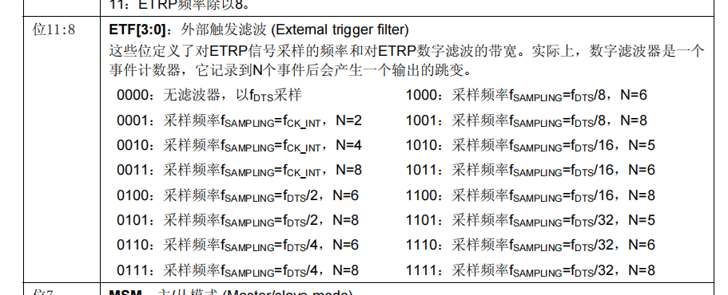

> 大量参考[江协科技](https://www.bilibili.com/video/BV1th411z7sn?p=14&vd_source=a72069186a610509925b0932bb49f8cc)视频，十分感谢给出的教程
>

## 计算公式

```shell
CK_CNT=CK_PSC/(PSC+1)
CK_CNT_OV=CK_CNT/(ARR+1)
CK_CNT_OV=CK_PSC/(PSC+1)/(ARR+1)
# CK_PSC：stm32频率 72Mhz
# PSC：TIM_Prescaler值 max:65535  预分频器
# ARR：TIM_Period值 max:65535     自动重装器
# CK_CNT:计数计数频率
# CK_CNT_OV：频率
```

假设，计时1s,那么可先想到ARR=72,PSC=1000000,但是这样会超出max,所以，可以选用ARR=7200,PSC=10000的方案，但是不是唯一的，只要计算出CK_CNT_OV=1且设置的值不会超出即可，高的计数频率便设置高的计数，低的计数频率就设置低的计数

## 相关函数介绍

```c
void TIM_DeInit(TIM_TypeDef* TIMx);//恢复默认配置
void TIM_TimeBaseInit(TIM_TypeDef* TIMx, TIM_TimeBaseInitTypeDef* TIM_TimeBaseInitStruct);//时基单元初始化
void TIM_TimeBaseStructInit(TIM_TimeBaseInitTypeDef* TIM_TimeBaseInitStruct);//结构体变量赋值初值

void TIM_Cmd(TIM_TypeDef* TIMx, FunctionalState NewState);//计数器使能
void TIM_ITConfig(TIM_TypeDef* TIMx, uint16_t TIM_IT, FunctionalState NewState);//使能中断

void TIM_InternalClockConfig(TIM_TypeDef* TIMx);//使用内部时钟
void TIM_ITRxExternalClockConfig(TIM_TypeDef* TIMx, uint16_t TIM_InputTriggerSource);//使用itx其他定时器时钟
void TIM_TIxExternalClockConfig(TIM_TypeDef* TIMx, uint16_t TIM_TIxExternalCLKSource,
                                uint16_t TIM_ICPolarity, uint16_t ICFilter);//选择tix捕获通道时钟

void TIM_ETRClockMode1Config(TIM_TypeDef* TIMx, uint16_t TIM_ExtTRGPrescaler, uint16_t TIM_ExtTRGPolarity,
                             uint16_t ExtTRGFilter);//etr通过外部时钟模式1输入的时钟
void TIM_ETRClockMode2Config(TIM_TypeDef* TIMx, uint16_t TIM_ExtTRGPrescaler, 
                             uint16_t TIM_ExtTRGPolarity, uint16_t ExtTRGFilter);//etr通过外部时钟模式2输入的时钟
void TIM_ETRConfig(TIM_TypeDef* TIMx, uint16_t TIM_ExtTRGPrescaler, uint16_t TIM_ExtTRGPolarity,
                   uint16_t ExtTRGFilter);//配置etr引脚的预分频器、极性、滤波器等参数
void TIM_PrescalerConfig(TIM_TypeDef* TIMx, uint16_t Prescaler, uint16_t TIM_PSCReloadMode);//修改预分频值
void TIM_CounterModeConfig(TIM_TypeDef* TIMx, uint16_t TIM_CounterMode);//改变计数器的计数模式
void TIM_ARRPreloadConfig(TIM_TypeDef* TIMx, FunctionalState NewState);//知道自动重装器预装功能配置
void TIM_SetCounter(TIM_TypeDef* TIMx, uint16_t Counter);//向指定计数器写入值
TIM_SetAutoreload(TIM_TypeDef* TIMx, uint16_t Autoreload);//给自动重装器写一个值
uint16_t TIM_GetCounter(TIM_TypeDef* TIMx);//获取当前计数器的值
uint16_t TIM_GetPrescaler(TIM_TypeDef* TIMx);//获取当前预分频器的值
/*获取/清除标志位*/
FlagStatus TIM_GetFlagStatus(TIM_TypeDef* TIMx, uint16_t TIM_FLAG);
void TIM_ClearFlag(TIM_TypeDef* TIMx, uint16_t TIM_FLAG);
ITStatus TIM_GetITStatus(TIM_TypeDef* TIMx, uint16_t TIM_IT);
void TIM_ClearITPendingBit(TIM_TypeDef* TIMx, uint16_t TIM_IT);
```

## 配置使用内部时钟

```c
void Timer_Init(void)
{
	RCC_APB1PeriphClockCmd(RCC_APB1Periph_TIM2, ENABLE);//启用定时器2的时钟
	
	TIM_InternalClockConfig(TIM2);//设置时钟为内部时钟
	
	TIM_TimeBaseInitTypeDef TIM_TimeBaseInitStructure;//初始化定时器结构体
	TIM_TimeBaseInitStructure.TIM_ClockDivision = TIM_CKD_DIV1;//设置分频系数
	TIM_TimeBaseInitStructure.TIM_CounterMode = TIM_CounterMode_Up;//设置计数模式
	TIM_TimeBaseInitStructure.TIM_Period = 10000 - 1;//设置自动重装值
	TIM_TimeBaseInitStructure.TIM_Prescaler = 7200 - 1;//设置预分频器的值
	TIM_TimeBaseInitStructure.TIM_RepetitionCounter = 0;//设置重复寄存器值，仅高级寄存器有效
	TIM_TimeBaseInit(TIM2, &TIM_TimeBaseInitStructure);//初始化定时器
	
	TIM_ClearFlag(TIM2, TIM_FLAG_Update);//防止初始化时进入中断
	TIM_ITConfig(TIM2, TIM_IT_Update, ENABLE);//启用定时器
	
	NVIC_PriorityGroupConfig(NVIC_PriorityGroup_2);//设置NVIC智能高端分组
	
	NVIC_InitTypeDef NVIC_InitStructure;//初始化NVIC结构体
	NVIC_InitStructure.NVIC_IRQChannel = TIM2_IRQn;//设置中断触发通道
	NVIC_InitStructure.NVIC_IRQChannelCmd = ENABLE;//启用
	NVIC_InitStructure.NVIC_IRQChannelPreemptionPriority = 2;//设置抢占优先级值
	NVIC_InitStructure.NVIC_IRQChannelSubPriority = 1;//设置响应优先级的值
	NVIC_Init(&NVIC_InitStructure);//初始化 NVIC
	
	TIM_Cmd(TIM2, ENABLE);//启用TIM2定时器
}

void TIM2_IRQHandler(void)//定时中断函数
{
	if (TIM_GetITStatus(TIM2, TIM_IT_Update) == SET)
	{
		
		TIM_ClearITPendingBit(TIM2, TIM_IT_Update);
	}
}
```

假设使用TIM2

### 配置时钟

TIM2属于APB1总线的外设，所以初始化APB1

```c
RCC_APB1PeriphClockCmd(RCC_APB1Periph_TIM2, ENABLE);
```

### 选择时基单元时钟

这里先择使用内部时钟，其实使用内部时钟也可以不写，默认就是使用内部时钟

```c
TIM_InternalClockConfig(TIM2);
```

### 配置时基单元

```c
TIM_TimeBaseInit(TIM2, &TIM_TimeBaseInitStructure);
```

其中结构体

```c
TIM_TimeBaseInitTypeDef TIM_TimeBaseInitStructure;
TIM_TimeBaseInitStructure.TIM_ClockDivision = TIM_CKD_DIV1;
TIM_TimeBaseInitStructure.TIM_CounterMode = TIM_CounterMode_Up;
TIM_TimeBaseInitStructure.TIM_Period = 10000 - 1; //ARR
TIM_TimeBaseInitStructure.TIM_Prescaler = 7200 - 1; //PSC
TIM_TimeBaseInitStructure.TIM_RepetitionCounter = 0;·
```

> TIM_ClockDivision：指定时钟分频
>
> ```c
> /** @defgroup TIM_Clock_Division_CKD 
>   * @{
>   */
> 
> #define TIM_CKD_DIV1                       ((uint16_t)0x0000)//不分频
> #define TIM_CKD_DIV2                       ((uint16_t)0x0100)//2分频
> #define TIM_CKD_DIV4                       ((uint16_t)0x0200)//4分频
> #define IS_TIM_CKD_DIV(DIV) (((DIV) == TIM_CKD_DIV1) || \
>                              ((DIV) == TIM_CKD_DIV2) || \
>                              ((DIV) == TIM_CKD_DIV4))
> ```
>
> TIM_CounterMode：计数模式
>
> ```c
> /** @defgroup TIM_Counter_Mode 
>   * @{
>   */
> 
> #define TIM_CounterMode_Up                 ((uint16_t)0x0000)//向上计数
> #define TIM_CounterMode_Down               ((uint16_t)0x0010)//向下计数
> #define TIM_CounterMode_CenterAligned1     ((uint16_t)0x0020)//三种中央对齐
> #define TIM_CounterMode_CenterAligned2     ((uint16_t)0x0040)
> #define TIM_CounterMode_CenterAligned3     ((uint16_t)0x0060)
> #define IS_TIM_COUNTER_MODE(MODE) (((MODE) == TIM_CounterMode_Up) ||  \
>                                    ((MODE) == TIM_CounterMode_Down) || \
>                                    ((MODE) == TIM_CounterMode_CenterAligned1) || \
>                                    ((MODE) == TIM_CounterMode_CenterAligned2) || \
>                                    ((MODE) == TIM_CounterMode_CenterAligned3))
> ```
>
> TIM_Period：周期，ARR自动重装器的值 
>
> TIM_Prescaler：预分频器的值
>
> 上两式需要以下公式
>
> ```c
> CK_CNT_OV=CK_CNT/(ARR+1)=CK_PSC/(PSC+1)/(ARR+1)
> ```
>
> 假设定时1s，也就是1hz，1=75m/10000/7200，也就是PSC=10000-1，ARR=7200-1，需要注意的是这不是唯一解，但是需要注意的是值需要0~65535之间
>
> TIM_RepetitionCounter：重复计数器的值，此为高级计数器才有，TIM2为普通计数器，没有此项

### 使能中断

```c
TIM_ClearFlag(TIM2, TIM_FLAG_Update);
```

```c
/**
  * @brief  Clears the TIMx's pending flags.
  * @param  TIMx: where x can be 1 to 17 to select the TIM peripheral.
  * @param  TIM_FLAG: specifies the flag bit to clear.
  *   This parameter can be any combination of the following values:
  *     @arg TIM_FLAG_Update: TIM update Flag
  *     @arg TIM_FLAG_CC1: TIM Capture Compare 1 Flag
  *     @arg TIM_FLAG_CC2: TIM Capture Compare 2 Flag
  *     @arg TIM_FLAG_CC3: TIM Capture Compare 3 Flag
  *     @arg TIM_FLAG_CC4: TIM Capture Compare 4 Flag
  *     @arg TIM_FLAG_COM: TIM Commutation Flag
  *     @arg TIM_FLAG_Trigger: TIM Trigger Flag
  *     @arg TIM_FLAG_Break: TIM Break Flag
  *     @arg TIM_FLAG_CC1OF: TIM Capture Compare 1 overcapture Flag
  *     @arg TIM_FLAG_CC2OF: TIM Capture Compare 2 overcapture Flag
  *     @arg TIM_FLAG_CC3OF: TIM Capture Compare 3 overcapture Flag
  *     @arg TIM_FLAG_CC4OF: TIM Capture Compare 4 overcapture Flag
  * @note
  *   - TIM6 and TIM7 can have only one update flag. 
  *   - TIM9, TIM12 and TIM15 can have only TIM_FLAG_Update, TIM_FLAG_CC1,
  *      TIM_FLAG_CC2 or TIM_FLAG_Trigger. 
  *   - TIM10, TIM11, TIM13, TIM14, TIM16 and TIM17 can have TIM_FLAG_Update or TIM_FLAG_CC1.   
  *   - TIM_FLAG_Break is used only with TIM1, TIM8 and TIM15. 
  *   - TIM_FLAG_COM is used only with TIM1, TIM8, TIM15, TIM16 and TIM17.   
  * @retval None
  */
void TIM_ClearFlag(TIM_TypeDef* TIMx, uint16_t TIM_FLAG)
```

> 参数1、选择定时器
>
> 参数2、更新中断
>
> 参数3、是否启用

### 配置NVIC

```c
NVIC_PriorityGroupConfig(NVIC_PriorityGroup_2);//设置中断分组

NVIC_InitTypeDef NVIC_InitStructure;//创建结构体
NVIC_InitStructure.NVIC_IRQChannel = TIM2_IRQn;//中断通道
NVIC_InitStructure.NVIC_IRQChannelCmd = ENABLE;//启用
NVIC_InitStructure.NVIC_IRQChannelPreemptionPriority = 2;//抢占优先级
NVIC_InitStructure.NVIC_IRQChannelSubPriority = 1;//响应优先级
NVIC_Init(&NVIC_InitStructure);//启动
```

### 启用定时器

```c
TIM_Cmd(TIM2, ENABLE);
```

### 书写中断函数

```c
void TIM2_IRQHandler(void)
{
	if (TIM_GetITStatus(TIM2, TIM_IT_Update) == SET)//确认是否是TIM2中断
	{
        /*code*/
		TIM_ClearITPendingBit(TIM2, TIM_IT_Update);//清除中断标志位
	}
}
```

### 总结

第一步，配置RCC定时器的时钟

第二步，配置时基单元为内部时钟（可以忽略）

第三步，配置时基单元，这一步最为重要

第四步，开启中断

第五步，配置NVIC以配置中断通道与中断的优先级

第六步，启动定时器

第七步，中断函数的具体实现


## 添加使用外部时钟

假设将外部时钟在PA0口

### 使用外部时钟

将**TIM_InternalClockConfig(TIM2);**替换为

即配置为外部时钟

```c
TIM_ETRClockMode2Config(TIM2, TIM_ExtTRGPSC_OFF, TIM_ExtTRGPolarity_NonInverted, 0x0F);
```

```c
/**
  * @brief  Configures the External clock Mode2
  * @param  TIMx: where x can be  1, 2, 3, 4, 5 or 8 to select the TIM peripheral.
  * @param  TIM_ExtTRGPrescaler: The external Trigger Prescaler.
  *   This parameter can be one of the following values:
  *     @arg TIM_ExtTRGPSC_OFF: ETRP Prescaler OFF.
  *     @arg TIM_ExtTRGPSC_DIV2: ETRP frequency divided by 2.
  *     @arg TIM_ExtTRGPSC_DIV4: ETRP frequency divided by 4.
  *     @arg TIM_ExtTRGPSC_DIV8: ETRP frequency divided by 8.
  * @param  TIM_ExtTRGPolarity: The external Trigger Polarity.
  *   This parameter can be one of the following values:
  *     @arg TIM_ExtTRGPolarity_Inverted: active low or falling edge active.
  *     @arg TIM_ExtTRGPolarity_NonInverted: active high or rising edge active.
  * @param  ExtTRGFilter: External Trigger Filter.
  *   This parameter must be a value between 0x00 and 0x0F
  * @retval None
  */
void TIM_ETRClockMode2Config(TIM_TypeDef* TIMx, uint16_t TIM_ExtTRGPrescaler, 
                             uint16_t TIM_ExtTRGPolarity, uint16_t ExtTRGFilter)
```

> 参数1、配置时钟TIMx
>
> 参数2、分频值
>
> 参数3、外部触发的极性，TIM_ExtTRGPolarity_Inverted下降沿或低电平有效，TIM_ExtTRGPolarity_NonInverted上升沿或者高电平有效
>
> 参数4、外部触发滤波器0x00 ~ 0x0f之间的值以采样频率f采样N个点
>



### 初始化时钟与GPIO

```c
RCC_APB2PeriphClockCmd(RCC_APB2Periph_GPIOA, ENABLE);

GPIO_InitTypeDef GPIO_InitStructure;
GPIO_InitStructure.GPIO_Mode = GPIO_Mode_IPU;//当小电平时，推荐使用浮空输入，如果电平够大，可以使用上拉输入，好处是防止跳动
GPIO_InitStructure.GPIO_Pin = GPIO_Pin_0;
GPIO_InitStructure.GPIO_Speed = GPIO_Speed_50MHz;
GPIO_Init(GPIOA, &GPIO_InitStructure);
```

### 改动后代码

```c
void Timer_Init(void)
{
	RCC_APB1PeriphClockCmd(RCC_APB1Periph_TIM2, ENABLE);
	RCC_APB2PeriphClockCmd(RCC_APB2Periph_GPIOA, ENABLE);
	
	GPIO_InitTypeDef GPIO_InitStructure;
	GPIO_InitStructure.GPIO_Mode = GPIO_Mode_IPU;
	GPIO_InitStructure.GPIO_Pin = GPIO_Pin_0;
	GPIO_InitStructure.GPIO_Speed = GPIO_Speed_50MHz;
	GPIO_Init(GPIOA, &GPIO_InitStructure);
	
	TIM_ETRClockMode2Config(TIM2, TIM_ExtTRGPSC_OFF, TIM_ExtTRGPolarity_NonInverted, 0xff);
	
	TIM_TimeBaseInitTypeDef TIM_TimeBaseInitStructure;
	TIM_TimeBaseInitStructure.TIM_ClockDivision = TIM_CKD_DIV1;
	TIM_TimeBaseInitStructure.TIM_CounterMode = TIM_CounterMode_Up;
	TIM_TimeBaseInitStructure.TIM_Period = 10 - 1;
	TIM_TimeBaseInitStructure.TIM_Prescaler = 1 - 1;
	TIM_TimeBaseInitStructure.TIM_RepetitionCounter = 0;
	TIM_TimeBaseInit(TIM2, &TIM_TimeBaseInitStructure);
	
	TIM_ClearFlag(TIM2, TIM_FLAG_Update);
	TIM_ITConfig(TIM2, TIM_IT_Update, ENABLE);
	
	NVIC_PriorityGroupConfig(NVIC_PriorityGroup_2);
	
	NVIC_InitTypeDef NVIC_InitStructure;
	NVIC_InitStructure.NVIC_IRQChannel = TIM2_IRQn;
	NVIC_InitStructure.NVIC_IRQChannelCmd = ENABLE;
	NVIC_InitStructure.NVIC_IRQChannelPreemptionPriority = 2;
	NVIC_InitStructure.NVIC_IRQChannelSubPriority = 1;
	NVIC_Init(&NVIC_InitStructure);
	
	TIM_Cmd(TIM2, ENABLE);
}
```

### 总结

第一步，配置RCC定时器的时钟，相较于内部时钟需要额外配置GPIO的时钟

第二步，配置时基单元为外部时钟，设置时钟号、分频值、触发极性、滤波器

之后的操作与配置使用内部时钟无异
