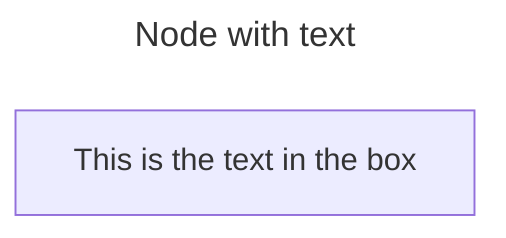
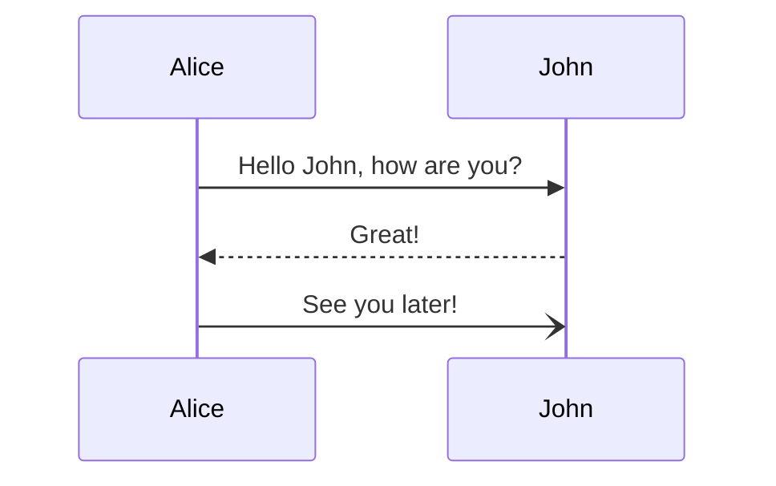
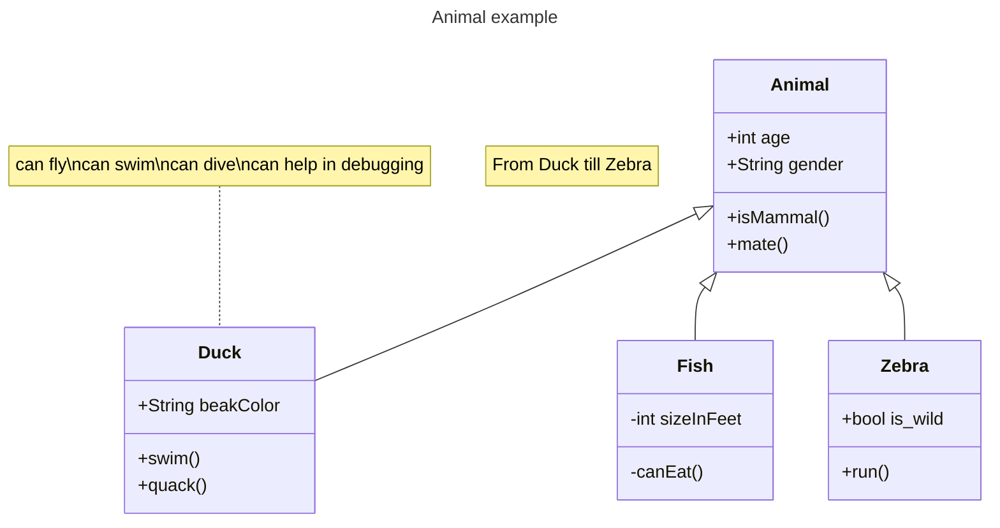
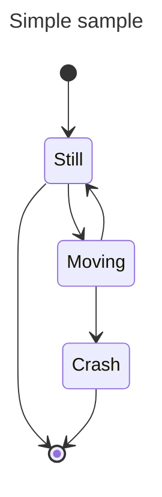
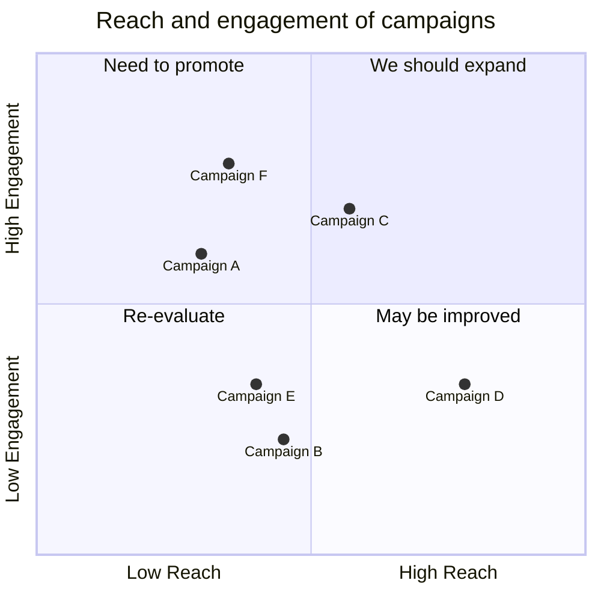
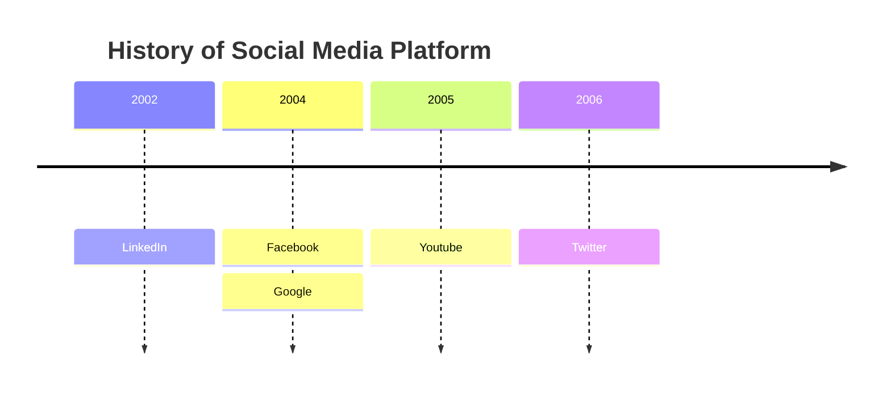
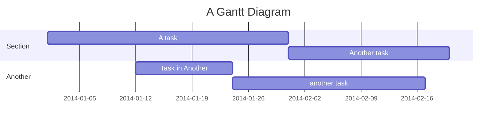

# 一级标题

段落之间由空行分隔。

第二段。_斜体_，**粗体**，和 `等宽字体`。项目列表看起来像这样：

- 这个
- 那个
- 另一个

注意，不考虑星号，实际文本内容从第4列开始。

> 块引用是这样写的。
>
> 它可以跨越多个段落，
> 如果你愿意的话。

使用3个破折号表示em-dash。使用2个破折号表示范围（例如，"它在第12--14章中"）。三个点...将被转换为省略号。
支持 Unicode。☺

## 二级标题

这里有一个编号列表：

1. 第一项
2. 第二项
3. 第三项

再次注意，实际文本从第4列开始（从左边数4个字符）。这里有一个代码示例：

    # Let me re-iterate ...
    for i in 1 .. 10 { do-something(i) }

正如你所猜到的，缩进4个空格。顺便说一下，如果你愿意，你可以使用分隔块代替缩进：

```
define foobar() {
    print "Welcome to flavor country!";
}
```

（这使复制和粘贴更容易）。你可以选择为 Pandoc 标记分隔块以进行语法高亮：

```python
import time
# Quick, count to ten!
for i in range(10):
    # (but not *too* quick)
    time.sleep(0.5)
    print i
```

### 三级标题

现在一个嵌套列表：

1. 首先，获取这些食材：

    - 胡萝卜
    - 芹菜
    - 扁豆

2. 煮一些水。

3. 把所有东西都倒进锅里，并按照
    这个算法操作：

        找到木勺
        揭开锅盖
        搅拌
        盖上锅盖
        把木勺危险地平衡在锅柄上
        等待10分钟
        返回第一步（或完成后关闭炉子）

    不要碰木勺，否则它会掉下来。

再次注意，文本总是以4个空格的缩进对齐（包括上面继续第3项的那一行）。

这里有一个链接到 [一个网站](http://foo.bar)，到 [本地文档](local-doc.html)，以及到当前文档中的 [一个节标题](#an-h2-header)。这里有一个脚注 [^1]。

[^1]: 脚注文本放在这里。

表格可以看起来像这样：

尺寸 材质 颜色

---

9 皮革 棕色
10 大麻帆布 自然
11 玻璃 透明

表格：鞋子的尺寸和它们是由什么制成的

（上面是表格的标题。）Pandoc 还支持多行表格：

---

关键字 文本

---

红色 日落，苹果，和其他
红色或红褐色的事物。

绿色 叶子，草地，青蛙
和其他不容易成为的事物。

---

一个水平线跟随。

---

这里有一个定义列表：

苹果
: 适合做苹果酱。
橙子
: 柠檬！
番茄
: 番茄中没有 "e"。

再次注意，文本缩进4个空格。（在每个术语/定义对之间放一个空行以更spread things out。）

这里有一个 "行块"：

| 行一
| 行二
| 行三

图片可以这样指定：

[//]: # (![example image]&#40;./demo-banner.png "An exemplary image"&#41;)

行内数学公式这样写：$\omega = d\phi / dt$。显示数学应该有自己的行，并用双美元符号包围：

$$I = \int \rho R^{2} dV$$

注意，你可以使用反斜杠转义任何你希望字面显示的标点符号，例如：\`foo\`，\*bar\*，等等。

### Mermaid

> https://mermaid.nodejs.cn

#### 流程图



#### 时序图 




#### 类图 



#### 状态图 




#### 象限图 




#### 时间线图 



# 甘特图



